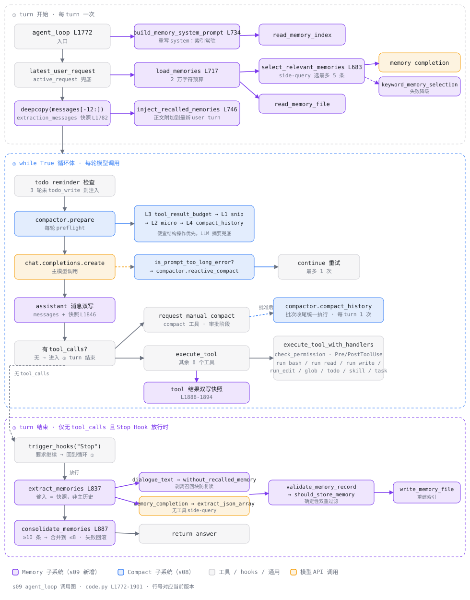

# s09 agent_loop 调用图

> 配套 [README.md](./README.md) 与 [ANALYSIS.md](./ANALYSIS.md) 阅读。
> 本图描述 [code.py](./code.py) 中 `agent_loop`（L1772-1901）一次用户 turn 的完整
> 调用关系，按"turn 开始 → 循环体 → turn 结束"三段组织。
> 行号对应 s09/code.py 当前版本。

图例：🟣 Memory 子系统（s09 新增）；🔵 Compact 子系统（s08）；🟠 模型 API 调用；
⬜ 工具 / hooks / 通用逻辑。

## 总览

## 三个阶段的要点

### ① turn 开始：记忆召回（每 turn 恰好一次）

| 调用 | 位置 | 作用 |
|---|---|---|
| `latest_user_request` | L1781 | `active_request` 未传时从历史尾部兜底 |
| `copy.deepcopy(messages[-12:])` | L1782 | 建立提取快照，与主历史隔离 |
| `build_memory_system_prompt` → `read_memory_index` | L734 | 只把 `MEMORY.md` 索引放进 system |
| `load_memories` → `select_relevant_memories` | L717 / L683 | side-query 选最多 5 条，2 万字符预算 |
| ↳ `memory_completion` + `extract_json_array` | L631 / L616 | 无工具侧调用，只收 JSON 下标数组 |
| ↳ `keyword_memory_selection`（降级） | L664 | API 失败时确定性关键词打分 |
| `inject_recalled_memories` | L746 | 正文包 `<relevant-memories>` 附加到最新 user turn |

### ② while True 循环体：s08 管线原样运转 + 双写快照

| 调用 | 位置 | 作用 |
|---|---|---|
| todo reminder 检查 | L1799-1806 | 3 轮未 `todo_write` 注入提醒 |
| `compactor.prepare` | L1808 | 每轮 preflight：L3 → L1 → L2 → L4 |
| `chat.completions.create` | L1825 | 主模型调用 |
| `is_prompt_too_long_error` → `reactive_compact` | L1828-1837 | 溢出兜底，最多重试 1 次 |
| assistant 消息双写 | L1845-1846 | 主历史 + 提取快照同步追加 |
| `request_manual_compact` | L1870 | `compact` 工具的审批阶段（hooks + 去重） |
| `execute_tool` → `execute_tool_with_handlers` | L1877 | 权限 + Pre/PostToolUse + 各 handler |
| tool 结果双写 | L1881-1894 | 同上，快照保持与主历史同细节 |
| `compactor.compact_history` | L1897-1900 | 批准的手动压缩在批次收尾统一执行 |

### ③ turn 结束：记忆提取与整理（仅最终回答时）

| 调用 | 位置 | 作用 |
|---|---|---|
| `trigger_hooks("Stop")` | L1850 | 要求继续则回到循环，不提取 |
| `extract_memories` | L837 / L1857 | 输入是快照——不受本 turn 内 Compact 影响 |
| ↳ `dialogue_text` → `without_recalled_memory` | L765 / L606 | 剥离召回块，防旧记忆复读 |
| ↳ `memory_completion` → `extract_json_array` | L631 / L616 | 无工具 side-query，只收结构化输出 |
| ↳ `validate_memory_record` → `should_store_memory` | L778 / L808 | 字段白名单 + scope/临时语义/敏感模式/查重 |
| ↳ `write_memory_file` | L508 | 写记录并重建索引 |
| `consolidate_memories` | L887 / L1858 | ≥10 条合并到 ≤8，快照回滚式写入 |

## 两条贯穿性线索

1. **双写快照**：`extraction_messages` 在 ① 建立，②每轮 assistant / tool 消息
   同步追加，③ 作为提取输入——主历史随时可被 s08 的 auto / reactive / manual
   Compact 有损重写，快照保证持久层看到的是本 turn 原始细节。
2. **side-query 统一口径**：召回选择、提取、整理三处都经 `memory_completion`
   （不带 tools + 数据降权 system + 只收 JSON），任何一处失败都降级或跳过，
   绝不影响主回答。
