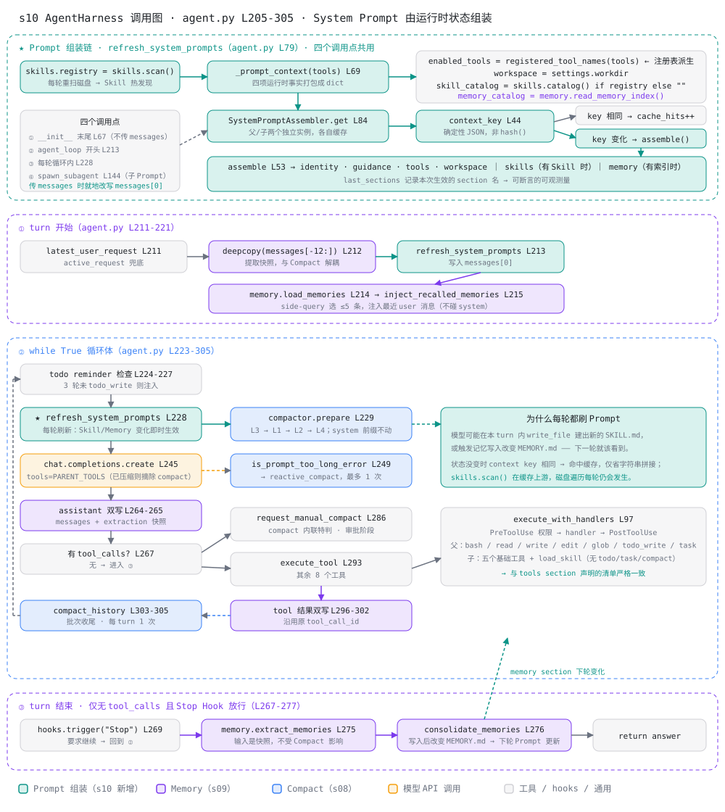

# s10 agent_loop 调用图

> 配套 [README.md](./README.md) 与 [ANALYSIS.md](./ANALYSIS.md) 阅读。
> 本图描述 [harness/agent_loop.py](./harness/agent_loop.py) 中 `agent_loop`
> （L163-L292）一次用户 turn 的完整调用关系，按"装配 → turn 开始 → 循环体 →
> turn 结束"四段组织。未标模块名的行号都属于 `agent_loop.py`。

图例：🟢 Prompt 组装（s10 新增）；🟣 Memory 子系统（s09）；🔵 Compact 子系统
（s08）；🟠 模型 API 调用；⬜ 循环阶段、工具与 Hook。

## 总览



## 四个阶段的要点

### ⓪ 装配：composition root 只在这里执行

| 调用 | 位置 | 作用 |
|---|---|---|
| `SkillLoader` / `TodoManager` / `BuiltinTools` | L51-L53 | 先建有状态能力 |
| `install_default_hooks` → `ToolExecutor` | L57-L58 | Hook 必须早于执行器 |
| `CompactToolController` / `ContextCompactor` | L61-L62 | 控制面与算法面分离 |
| `memory.configure(settings)` | L69 | 把模块级 Memory 绑定到本 Harness |
| 父 / 子 `SystemPromptAssembler` | L72-L77 | 身份不同，缓存也各自独立 |
| `refresh_system_prompts()` | L80 | 生成首版 Prompt，供 `code.py` 建首条消息 |
| `SubagentRunner(prompt_supplier=...)` | L85-L91 | 子 Agent 只拿到取 Prompt 的回调 |

### ① turn 开始：每 turn 恰好一次

| 调用 | 位置 | 作用 |
|---|---|---|
| `latest_user_request` | L172 | `active_request` 未传时从历史尾部兜底 |
| `copy.deepcopy(messages[-12:])` | L176 | 建立提取快照，与主历史隔离 |
| `refresh_system_prompts(messages)` | L179 | 先把最新 Prompt 写回 `messages[0]` |
| `memory.load_memories` | L180 / memory.py L303 | side-query 选最多 5 条 |
| `memory.inject_recalled_memories` | L181 / memory.py L332 | 正文附加到最新 user turn |

顺序是刻意的：Prompt 刷新在召回之前，所以 memory section 反映的是本 turn 开始时
的索引状态，而随后注入的 `<relevant-memories>` 正文只影响 user 消息。

### ② 循环体：每次模型调用前重建 Prompt

| 调用 | 位置 | 作用 |
|---|---|---|
| todo reminder 检查 | L195-L202 | 连续 3 轮未 `todo_write` 注入提醒 |
| `refresh_system_prompts(messages)` | L205 | 反映本轮工具、Skill、Memory 状态 |
| `compactor.prepare` | L206 / context_compact.py L315 | L3 → L1 → L2 → L4 |
| 过滤 `compact` schema | L209-L216 | 本 turn 压缩过就不再暴露该工具 |
| `provider.completion_request` | L220 / provider.py L32 | 收口模型专属参数 |
| `chat.completions.create` | L219 | 🟠 主模型调用 |
| `is_prompt_too_long_error` → `reactive_compact` | L225-L233 | 溢出兜底，最多重试 1 次 |
| assistant 消息双写 | L239-L240 | 主历史 + 提取快照同步追加 |

刷新一定在 `prepare` 之前：否则压缩会按旧 Prompt 体积估算预算。

### ③ 工具批次：compact 是唯一例外

| 调用 | 位置 | 作用 |
|---|---|---|
| `CompactToolController.request` | L270 / context_compact.py L379 | 校验空参数、走 Hook、每 turn 限一次 |
| `ToolExecutor.execute` | L278 / tool_use.py L146 | 解析 → PreToolUse → handler → PostToolUse |
| ↳ `PermissionPolicy.check` | hooks.py L70 / permission.py L73 | 硬拒绝或交互确认，返回非 None 即短路 |
| ↳ handler | L92-L96 / tool_use.py L282 | `BuiltinTools` / `TodoManager` / `SubagentRunner` |
| `role=tool` 双写 | L282-L288 | 每个 `tool_call_id` 都要有配对结果 |
| `compactor.compact_history` | L289-L292 / context_compact.py L274 | 批次收尾才真正改写历史 |

`compact` 不能当普通 handler：它要替换整个 `messages`，所以在循环里内联拦截，
并延迟到整批 `role=tool` 写完之后执行，避免留下不完整的 assistant / tool 协议组。

### ④ turn 结束：仅在给出最终回答时

| 调用 | 位置 | 作用 |
|---|---|---|
| `hooks.trigger("Stop")` | L247 | 返回非 None 则追加 user 消息并回到 ② |
| `memory.extract_memories` | L255 / memory.py L425 | 输入是快照，不受本 turn 压缩影响 |
| `memory.consolidate_memories` | L256 / memory.py L476 | ≥10 条合并到 ≤8 条 |
| `return answer` | L257 | 唯一的正常出口 |

## Prompt 组装链

`refresh_system_prompts`（L110）是唯一入口，四个调用点分布在三个阶段：

| 调用点 | 阶段 | 说明 |
|---|---|---|
| L80 | ⓪ | 装配末段，`code.py` 据此构造首条 system 消息 |
| L179 | ① | 每 turn 一次，写回 `messages[0]` |
| L205 | ② | 每轮一次，且必须早于 `prepare` |
| L134 | — | `_subagent_system_prompt`，SubAgent 启动时取最新子 Prompt |

内部链路：

```text
skills.scan()                          skill_loading.py L49   每轮热发现
  → _prompt_context(PARENT_TOOLS)      L98                    收集运行态
  → SystemPromptAssembler.get()        system_prompt.py L88
       → context_key(sort_keys JSON)   L45                    稳定序列化
       → 命中 ? cache_hits++ : assemble() L55
  → _prompt_context(SUB_TOOLS) → sub_prompt.get()             子 Agent 同源不同表
  → messages[0]["content"] = system_prompt                    L127-L130
```

## 依赖层

| 层 | 模块 | 内部依赖 |
|---|---|---|
| L0 | `config.py`、`models.py`、`system_prompt.py` | 无 |
| L1 | `provider.py`、`permission.py`、`skill_loading.py`、`todo_write.py` | L0 |
| L2 | `hooks.py`（→ `permission`）、`memory.py`（→ `skill_loading`） | L0-L1 |
| L3 | `tool_use.py`、`context_compact.py`（均 → `hooks`） | L0-L2 |
| L4 | `subagent.py`（→ `tool_use`） | L0-L3 |
| L5 | `agent_loop.py` | L0-L4，composition root |

课程编号是学习顺序，不是依赖层级：`agent_loop.py` 对应 s01，却位于最上层。
下层模块都不导入 `AgentHarness`，因此依赖图无环。

## 三条贯穿性线索

1. **Prompt 是运行态的投影**：`enabled_tools` 来自 schema 注册表，`skill_catalog`
   来自每轮扫盘，`memory_catalog` 来自 `MEMORY.md`。任何一处变化都会改变
   `context_key`，下一次调用即重建；没有变化则复用字符串，只是仍要付一次扫盘成本。
2. **双写快照**：`extraction_messages` 在 ① 建立，② 与 ③ 同步追加 assistant 与
   tool 消息，④ 作为提取输入——主历史随时可能被 auto / reactive / manual Compact
   有损重写，快照保证持久层看到本 turn 的原始细节。
3. **协议组完整性**：L1 裁剪、reactive 压缩和手动 compact 都以 assistant tool
   call 与其后连续 `role=tool` 为最小单元；`system_prefix`
   （context_compact.py L71）确保替换全历史时首条 System Prompt 不被丢弃。
