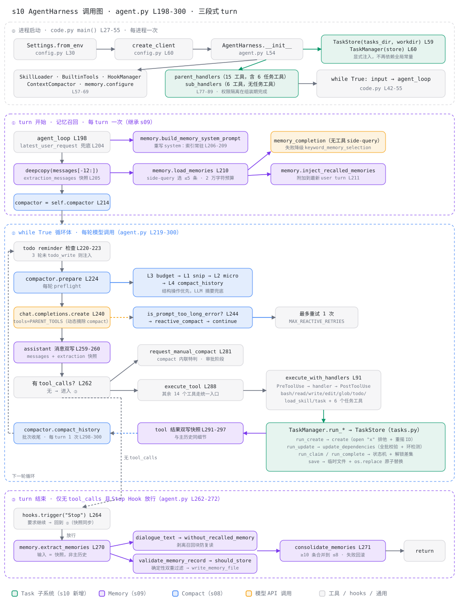

# s10 AgentHarness 调用图

> 配套 [README.md](./README.md) 与 [ANALYSIS.md](./ANALYSIS.md) 阅读。
> 本图描述 [harness/agent.py](./harness/agent.py) 中 `AgentHarness.agent_loop`
> （L198-300）一次用户 turn 的完整调用关系，并补上 s10 新增的进程启动组装阶段。
> 行号对应各模块当前版本。

图例：🟢 Task 子系统（s10 新增）；🟣 Memory（s09）；🔵 Compact（s08）；
🟠 模型 API 调用；⬜ 工具 / hooks / 通用逻辑。

## 总览

## 四个阶段的要点

### ⓪ 进程启动：组装期完成配置注入与权限隔离（s10 新增）

s09 在导入时就用模块级常量定死路径；s10 把这一步显式化，成为可测试的组装阶段。

| 调用 | 位置 | 作用 |
|---|---|---|
| `Settings.from_env` | config.py L30 | 一次解析 `CC_WORKDIR` / `CC_SKILLS_DIR` / `CC_MEMORY_DIR` / `CC_TASKS_DIR` |
| `create_client` | config.py L60 | 百炼 OpenAI-compatible client，不打印凭据 |
| `AgentHarness.__init__` | agent.py L54 | 组装全部组件 |
| ↳ `TaskStore(tasks_dir, workdir)` / `TaskManager(store)` | agent.py L59-60 | **本章新增**，路径边界随构造参数传入 |
| ↳ `SkillLoader` / `BuiltinTools` / `HookManager` / `ContextCompactor` | agent.py L57-68 | 前几章能力 |
| ↳ `memory.configure(settings)` | agent.py L69 | 把配置写回 memory 模块全局（平移 s09 的妥协） |
| ↳ `parent_handlers` / `sub_handlers` | agent.py L77-89 | 15 / 6 个工具，**任务工具的父级独占在此固化** |
| `while True: input → agent_loop` | code.py L42-55 | CLI 主循环 |

### ① turn 开始：记忆召回（继承 s09，逐段等价）

| 调用 | 位置 | 作用 |
|---|---|---|
| `latest_user_request` | agent.py L204 | `active_request` 未传时兜底 |
| `copy.deepcopy(messages[-12:])` | agent.py L205 | 提取快照，与 Compact 解耦 |
| `memory.build_memory_system_prompt` | agent.py L206-209 | 只把 `MEMORY.md` 索引放进 system |
| `memory.load_memories` | agent.py L210 | side-query 选 ≤5 条，2 万字符预算 |
| ↳ `memory_completion` / `keyword_memory_selection` | memory.py | 无工具侧调用，失败降级关键词打分 |
| `memory.inject_recalled_memories` | agent.py L211 | 包 `<relevant-memories>` 附加到最新 user turn |

### ② while True 循环体：s08 管线 + 工具执行 + 任务图落盘

| 调用 | 位置 | 作用 |
|---|---|---|
| todo reminder 检查 | agent.py L220-223 | 3 轮未 `todo_write` 注入提醒（s10 起不再 print） |
| `compactor.prepare` | agent.py L224 | 每轮 preflight：L3 → L1 → L2 → L4 |
| `chat.completions.create` | agent.py L240 | `tools=PARENT_TOOLS`，已压缩过则动态摘除 `compact` |
| `is_prompt_too_long_error` → `reactive_compact` | agent.py L244-251 | 溢出兜底，最多重试 1 次（s10 起不再 print） |
| assistant 消息双写 | agent.py L259-260 | 主历史 + 提取快照 |
| `request_manual_compact` | agent.py L281 | `compact` 内联特判：参数校验 + hooks + 同轮去重 |
| `execute_tool` → `execute_with_handlers` | agent.py L288 / L91 | 其余 14 个工具走统一入口：PreToolUse → handler → PostToolUse |
| ↳ `TaskManager.run_create` → `TaskStore.create` | tasks.py L276 / L93 | `open("x")` 排他创建 + 冲突重摇 ID |
| ↳ `run_update` → `update_dependencies` | tasks.py L284 / L168 | 全批校验、去重、自依赖与传递环检测后才保存 |
| ↳ `run_claim` / `run_complete` → 状态机 | tasks.py L322-326 / L224, L238 | 依赖齐备才认领；完成时用差集报告新解锁 |
| ↳ `TaskStore.save` | tasks.py L118 | 同目录临时文件 + `os.replace` 原子替换 |
| tool 结果双写 | agent.py L291-297 | 快照与主历史同细节 |
| `compactor.compact_history` | agent.py L298-300 | 批准的手动压缩在批次收尾统一执行 |

### ③ turn 结束：记忆提取与整理（仅最终回答时）

| 调用 | 位置 | 作用 |
|---|---|---|
| `hooks.trigger("Stop")` | agent.py L264 | 要求继续则回到循环，续写消息也同步进快照 |
| `memory.extract_memories` | agent.py L270 | 输入是快照——不受本 turn 内 Compact 影响 |
| ↳ `dialogue_text` → `without_recalled_memory` | memory.py | 剥离召回块，防旧记忆复读 |
| ↳ `validate_memory_record` → `should_store_memory` | memory.py | 字段白名单 + scope / 临时语义 / 敏感模式 / 查重 |
| ↳ `write_memory_file` | memory.py | 写记录并重建索引 |
| `memory.consolidate_memories` | agent.py L271 | ≥10 条合并到 ≤8，快照回滚式写入 |

## 三条贯穿性线索

1. **任务工具没有特权路径**：六个任务工具是普通 handler，与 `bash`、`read_file`
   走同一个 `execute_with_handlers`，因此自动受权限管线和 Pre/PostToolUse Hook
   约束。只有 `compact` 仍需内联特判，因为它要改写 `messages` 本身。
2. **持久层与上下文层三条独立通道**：`.tasks/`（任务图，跨会话）、`.memory/`
   （长期事实，跨会话）、`.transcripts/` + `.task_outputs/`（压缩归档，会话内可回溯）。
   三者互不依赖，任何一条失效都不阻断主回答。
3. **组装期决定隔离，运行期只查表**：父/子工具集与 handler 表在 `__init__` 就固定
   （agent.py L77-89），循环体内不再做"这个工具允许吗"的判断——权限边界是结构性的，
   不是每轮重新推导的。
