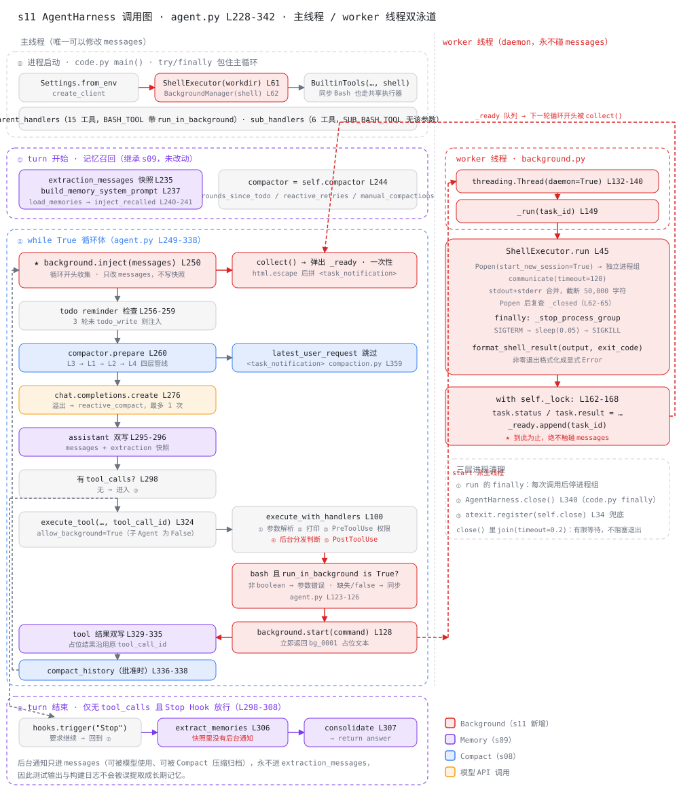

# s11 AgentHarness 调用图

> 配套 [README.md](./README.md) 与 [ANALYSIS.md](./ANALYSIS.md) 阅读。
> 本图描述 [harness/agent.py](./harness/agent.py) 中 `AgentHarness.agent_loop`
> （L228-338）一次用户 turn 的调用关系。与 s09/s10 不同，本章有**两条泳道**：
> 主线程与 worker 线程。行号对应各模块当前版本。

图例：🔴 Background（s11 新增）；🟣 Memory（s09）；🔵 Compact（s08）；
🟠 模型 API 调用；⬜ 工具 / hooks / 通用逻辑。

## 总览



## 双泳道的单向数据流

s11 的正确性建立在一条纪律上：**worker 只写队列，主线程只在轮次边界读队列**。

```text
主线程                                    worker 线程
──────────────────────────────           ─────────────────────────
execute_tool
  └─ PreToolUse 权限 ✅
  └─ background.start()  ──派生──▶       threading.Thread(daemon)
  └─ 占位 role=tool 入列                    └─ ShellExecutor.run()
  └─ 继续下一轮模型调用                       └─ _ready.append(id)
                                              ★ 到此为止
循环开头 background.inject()  ◀──读取──   _ready 队列
  └─ collect() 弹出 + html.escape
  └─ 拼 <task_notification> 进 messages
```

`messages` 的写权限始终只在主线程，所以不需要给消息列表加锁。代价是**后台完成不会
主动唤醒 Agent**——通知只在下一轮模型请求前或下一个用户 turn 被看到。

## 四个阶段的要点

### ⓪ 进程启动：共享执行器 + 三层清理

| 调用 | 位置 | 作用 |
|---|---|---|
| `Settings.from_env` / `create_client` | config.py | 与 s10 完全一致 |
| `ShellExecutor(settings.workdir)` | agent.py L61 | **本章新增**，独立进程组 + 120s 超时 |
| `BackgroundManager(self.shell)` | agent.py L62 | 持有 `tasks` / `_threads` / `_ready` 三份状态 |
| `BuiltinTools(settings, skills, shell)` | agent.py L63 | 同步 Bash 也改用共享执行器 |
| `parent_handlers` / `sub_handlers` | agent.py L83-95 | 15 / 6 个工具；父子拿到不同的 bash schema |
| `try/finally: harness.close()` | code.py L46-62 | Ctrl-C 或异常退出都清进程组 |

### ① turn 开始：记忆召回（继承 s09，未改动）

| 调用 | 位置 | 作用 |
|---|---|---|
| `copy.deepcopy(messages[-12:])` | agent.py L235 | 提取快照——**后续不会收到后台通知** |
| `memory.build_memory_system_prompt` | agent.py L237 | 索引常驻 system |
| `memory.load_memories` → `inject_recalled_memories` | agent.py L240-241 | side-query 选 ≤5 条并注入 user turn |

### ② while True 循环体：收集通知在最前面

| 调用 | 位置 | 作用 |
|---|---|---|
| **`background.inject(messages)`** | agent.py L250 | **循环第一件事**；只改 `messages`，不写快照 |
| ↳ `collect()` | background.py L170 | 弹出 `_ready` 并从 `tasks` 删除——通知一次性 |
| ↳ `html.escape(command/summary)` | background.py L182-185 | 防命令输出伪造闭合标签 |
| todo reminder 检查 | agent.py L256-259 | 3 轮未 `todo_write` 注入提醒 |
| `compactor.prepare` | agent.py L260 | s08 四层管线 |
| ↳ `latest_user_request` 跳过 `<task_notification>` | compaction.py L359 | 通知不会被误当成当前用户请求 |
| `chat.completions.create` | agent.py L276 | 溢出走 `reactive_compact`，最多 1 次 |
| assistant 消息双写 | agent.py L295-296 | 主历史 + 提取快照 |
| `execute_tool(…, tool_call_id=…)` | agent.py L324 | `allow_background=True`（子 Agent 不传） |
| ↳ `execute_with_handlers` | agent.py L100 | 参数解析 → 打印 → **PreToolUse 权限** → 后台判断 → PostToolUse |
| ↳ `run_in_background is True`？ | agent.py L123-126 | 非 boolean 报参数错误；缺失/false 走同步 |
| ↳ `background.start(command)` | background.py L119 | 立即返回 `bg_0001` 占位文本 |
| tool 结果双写 | agent.py L329-335 | 占位结果沿用原 `tool_call_id` |
| `compact_history` | agent.py L336-338 | 批准的手动压缩批次收尾执行 |

### worker 线程：background.py

| 调用 | 位置 | 作用 |
|---|---|---|
| `threading.Thread(daemon=True)` | L132-140 | 不阻止进程退出 |
| `_run(task_id)` | L149 | 唯一的 worker 入口 |
| `ShellExecutor.run` | L45 | `Popen(start_new_session=True)` → 独立进程组 |
| ↳ `Popen` 后复查 `_closed` | L62-65 | 关掉"检查—启动"之间的窗口 |
| ↳ `finally: _stop_process_group` | L78-86 | `SIGTERM` → `sleep(0.05)` → `SIGKILL` |
| `format_shell_result` | L19 | 非零退出格式化成显式 `Error:` |
| `_ready.append(task_id)` | L162-168 | 锁内更新状态并入队，**到此为止** |

### ③ turn 结束：记忆提取与整理

| 调用 | 位置 | 作用 |
|---|---|---|
| `hooks.trigger("Stop")` | agent.py L300 | 要求继续则回到 ② |
| `memory.extract_memories` | agent.py L306 | 输入是快照——**其中没有任何后台通知** |
| `memory.consolidate_memories` | agent.py L307 | ≥10 条合并到 ≤8 |

## 三条贯穿性线索

1. **权限先于线程**：`PreToolUse` 的拒绝分支在后台判断之前就 return，所以
   `run_in_background: true` 不能用来绕过 `sudo`、`shutdown` 等硬拒绝规则。
2. **一个 tool call 一个 tool result**：后台启动时占位结果已占用 `tool_call_id`，
   完成通知只能是新的 `role=user` 消息。`BackgroundTask.tool_call_id` 保留作溯源，
   不用于配对。
3. **通知进上下文但不进记忆**：`inject` 只写 `messages`，是全流程里唯一"单写"的
   消息类型。因此 `pytest` 输出、构建日志能被模型使用、能被 Compact 归档，却不会被
   `extract_memories` 提取成长期事实。
