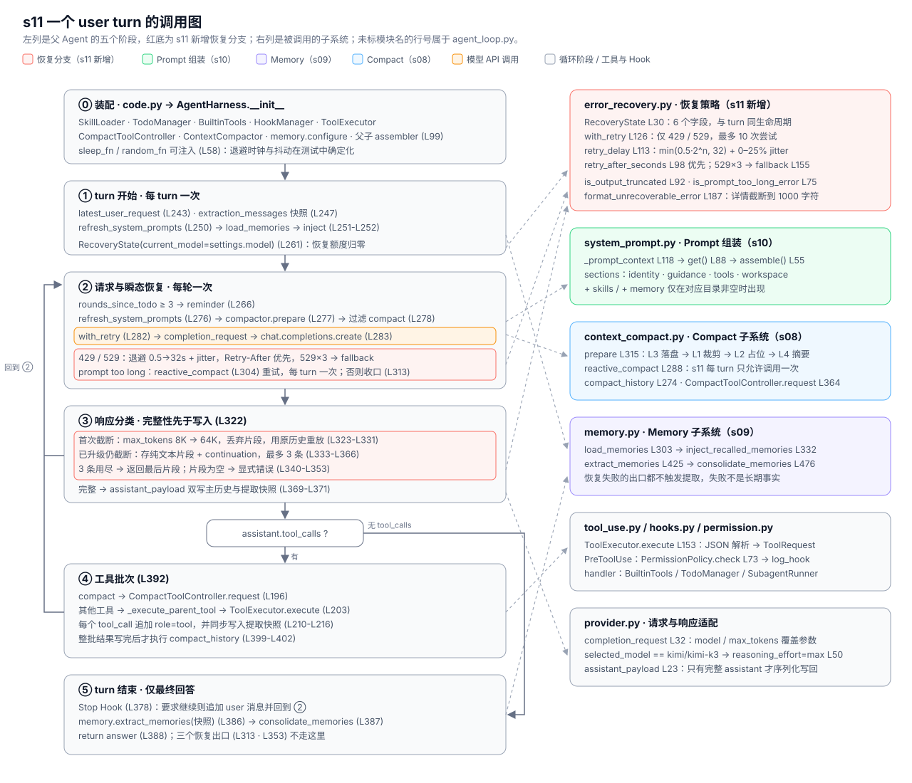
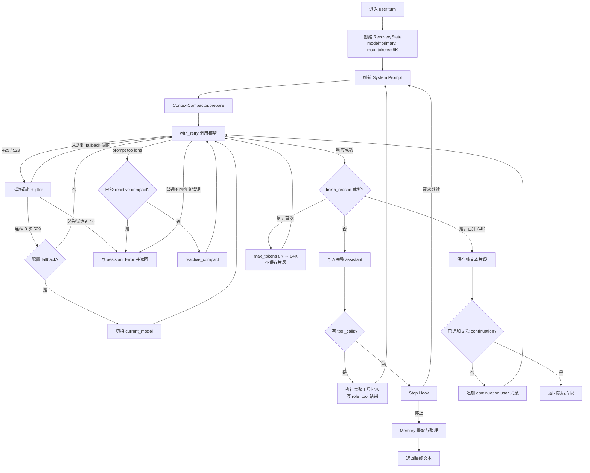

# s11 Agent Loop 调用图

> 配套 [README.md](./README.md) 与 [ANALYSIS.md](./ANALYSIS.md) 阅读。
> 图中只展开 s11 新增恢复分支；工具批次、Memory 和 System Prompt 的正常链路继续
> 沿用 s10。



## 主循环



## 恢复模块调用关系

```text
agent_loop.py
├─ RecoveryState(settings.model)
├─ with_retry(fn, state, fallback_model)
│  ├─ is_rate_limit_error
│  ├─ is_overloaded_error
│  ├─ retry_after_seconds
│  └─ retry_delay → sleep_fn
├─ is_prompt_too_long_error
│  └─ ContextCompactor.reactive_compact
├─ is_output_truncated
│  ├─ 8K → 64K 原请求重放
│  └─ partial assistant → continuation user
└─ format_unrecoverable_error
   └─ 最终 assistant Error
```

## 消息写入规则

| 分支 | assistant 写入 `messages` | user 写入 `messages` | 是否重试原请求 |
| --- | --- | --- | --- |
| 429 / 529 | 否 | 否 | 是 |
| 首次输出截断 | 否 | 否 | 是，提升到 64K |
| 64K 后输出截断 | 是，只保存文本片段 | 是，continuation | 否，续写 |
| 首次 prompt too long | 否 | 否，历史被压缩替换 | 是 |
| 第二次 prompt too long | 是，错误文本 | 否 | 否 |
| 普通不可恢复错误 | 是，错误文本 | 否 | 否 |
| 完整响应 | 是，完整 payload | 仅 Stop Hook 可能追加 | 按正常循环 |

最关键的边界是：未完成响应永远不会进入工具分发。只有
`finish_reason` 表示完整后，`assistant.tool_calls` 才可能由
`_execute_tool_batch()` 执行并逐个补齐 `role=tool` 消息。
