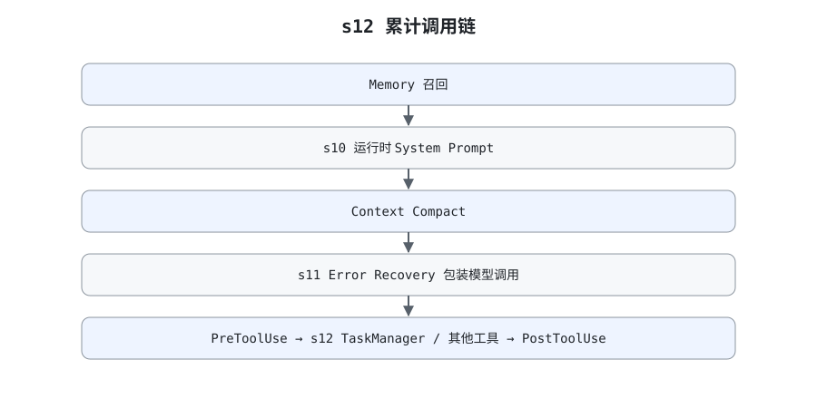

# s12 Task System 调用图

> 配套 [README.md](./README.md) 与 [ANALYSIS.md](./ANALYSIS.md) 阅读。
> 本图描述 s12 新增的任务板如何接入 [harness/agent_loop.py](./harness/agent_loop.py)
> 中的 `agent_loop`（L242-L410），按"装配 → turn 开始 → 请求与瞬态恢复 → 响应分类 →
> 工具批次 → turn 结束"六段组织，再单独展开五个任务工具的内部路径。
> 未标模块名的行号属于 `agent_loop.py`，任务侧行号属于 `task_system.py`。

图例：🟣 Task System（s12 新增）；🔴 恢复分支（s11）；🟢 Prompt 组装（s10）；
🟠 Memory 子系统（s09）；🔵 Compact 子系统（s08）；⬜ 循环阶段、工具与 Hook。

## 总览



图与本文档同构：左列自上而下是父 Agent 的六个阶段，右列是被它调用的子系统。

| 区域 | 内容 | 对应代码 |
| --- | --- | --- |
| 左列 ⓪–⑤ | 装配 → turn 开始 → 请求与瞬态恢复 → 响应分类 → 工具批次 → turn 结束 | L54-L124、L242-L410 |
| 左列紫底行 | s12 唯一的两处改动：装配任务板、任务 handler 走普通分发 | L75-L78、L121、L432 |
| 右列上四块 | 任务板自身：模块结构、严格状态机、依赖图、原子持久化 | L22-L441 |
| 右列下五块 | 复用的子系统：s11 恢复、工具与 Hook 管线、s10 Prompt、s08 Compact、s09 Memory | error_recovery.py L126 等 |

配色沿用前几章约定，与上面的图例一一对应：紫色是 s12 新增的任务板路径，红色是 s11
恢复分支，绿色 / 橙色 / 蓝色分别是 Prompt、Memory、Compact 子系统，灰色是循环阶段与
工具 / Hook，白框是判定节点与单个任务状态。虚线箭头表示"阶段调用子系统"。
底部一行提示两条最容易混淆的边界：TodoWrite 是内存清单，Task System 是持久任务板；
SubAgent 在两张表里都拿不到任务工具。

## 六个阶段的要点

### ⓪ 装配：composition root 只在这里执行

| 调用 | 位置 | 作用 |
|---|---|---|
| `sleep_fn` / `random_fn` 参数 | L59-L60 | 🔴 退避时钟与抖动可注入，测试不等待 |
| `SkillLoader` / `TodoManager` | L73-L74 | 先建有状态能力 |
| `settings.assert_inside_workdir` | L75-L77 / config.py L54 | 🟣 tasks 目录逃逸工作区则构造即失败 |
| `TaskManager(tasks_dir)` | L78 / L173 | 🟣 目录以 mode 700 建立，注册五个 handler |
| `BuiltinTools` | L79 | 文件与 Bash handler |
| `install_default_hooks` → `ToolExecutor` | L83-L84 | Hook 必须早于执行器 |
| `CompactToolController` / `ContextCompactor` | L87-L93 | 🔵 控制面与算法面分离 |
| `memory.configure(settings)` | L95 | 🟠 把模块级 Memory 绑定到本 Harness |
| 父 / 子 `SystemPromptAssembler` | L98-L103 | 🟢 身份不同，缓存也各自独立 |
| `refresh_system_prompts()` | L106 | 🟢 首版 Prompt 已含五个任务工具名 |
| `SubagentRunner(prompt_supplier=…)` | L111-L117 | 子 Agent 只拿到 `builtins.handlers()` |
| `**self.tasks.handlers()` | L121 / L432 | 🟣 任务 handler 只进父表，不进子表 |

装配同时建立两道隔离：`TASK_TOOLS` 只出现在 `PARENT_TOOLS`
（tool_use.py L137-L144），决定模型**看不看得到**任务工具；`self.tasks.handlers()`
只进 `_parent_handlers`（L119-L124），决定伪造调用**能不能真的执行**。

### ① turn 开始：每 turn 恰好一次

| 调用 | 位置 | 作用 |
|---|---|---|
| `latest_user_request` | L251 / context_compact.py L343 | `active_request` 未传时从历史尾部兜底 |
| `copy.deepcopy(messages[-12:])` | L255 | 建立提取快照，与主历史隔离 |
| `refresh_system_prompts(messages)` | L258 | 🟢 先把最新 Prompt 写回 `messages[0]` |
| `memory.load_memories` | L259 / memory.py L303 | 🟠 side-query 选最多 5 条 |
| `memory.inject_recalled_memories` | L260 / memory.py L332 | 🟠 正文附加到最新 user turn |
| `compactor = compactor or self.compactor` | L264 | 🔵 测试可注入替代压缩器 |
| `RecoveryState(settings.model)` | L269 / error_recovery.py L31 | 🔴 恢复额度归零，与 turn 同生命周期 |

三个计数器并列创建（L267-L269），都不跨 turn 累积。任务板**不在**这里加载：磁盘状态
只在模型显式调用 `list_tasks` / `get_task` 时读取，避免每 turn 无条件注入全部任务。

### ② 请求与瞬态恢复：每次循环一次

| 调用 | 位置 | 作用 |
|---|---|---|
| todo reminder 检查 | L274-L281 | 连续 3 轮未 `todo_write` 注入提醒 |
| `refresh_system_prompts(messages)` | L284 | 🟢 反映本轮工具、Skill、Memory 状态 |
| `compactor.prepare` | L285 / context_compact.py L315 | 🔵 L3 → L1 → L2 → L4 |
| `_visible_parent_tools` | L286 / L166 | 本 turn 压缩过就不再暴露 `compact` |
| `with_retry(fn, recovery, fallback)` | L290 / error_recovery.py L126 | 🔴 429 / 529 最多 10 次 |
| ↳ `provider.completion_request` | L292 / provider.py L32 | 收口 `model` 与 `max_tokens` 覆盖 |
| ↳ `chat.completions.create` | L291 | 主模型调用 |
| `is_prompt_too_long_error` | L309 / error_recovery.py L75 | 🔴 与瞬态错误分开判定 |
| ↳ `compactor.reactive_compact` | L312 / context_compact.py L288 | 🔵 每 turn 仅一次，压缩后 `continue` |
| `_append_failure_result` | L321 / L228 | 🔴 其余异常收口为最终 assistant 文本 |

刷新一定在 `prepare` 之前（L284 → L285）。父 Prompt 现在多了五个工具名，预算估算必须
看到最新体积。恢复分支全部以 `continue` 回到循环顶部，任务板不参与重试——它的状态已经
在磁盘上，重放请求不会重复创建任务。

### ③ 响应分类：完整性检查先于任何历史写入

| 调用 | 位置 | 作用 |
|---|---|---|
| `response.choices[0]` / `choice.message` | L325-L326 | 取本轮响应 |
| `is_output_truncated(finish_reason)` | L330 / error_recovery.py L92 | 🔴 `length` 与 `max_tokens` 都算截断 |
| 首次截断：`max_tokens = 64000` | L331-L339 | 🔴 丢弃片段，用原历史重放 |
| 已升级：保存纯文本片段 | L341-L345 | 🔴 只写 content，不写残缺 `tool_calls` |
| 达到 `MAX_CONTINUATIONS` | L348-L361 | 🔴 返回最后片段；片段为空则返回显式错误 |
| 追加 `CONTINUATION_PROMPT` | L363-L369 / error_recovery.py L19 | 🔴 最多 3 条续写提示 |
| `assistant_payload` | L377 / provider.py L23 | 完整消息才双写主历史与快照 |

截断分支在 `assistant_payload()` 之前就 `continue`，因此半个 `create_task` 参数永远
不会进入分发——不完整的响应不可能写出不完整的任务文件。

### ④ 工具批次：任务工具走普通分发，compact 仍是唯一例外

| 调用 | 位置 | 作用 |
|---|---|---|
| `_execute_tool_batch` | L400 / L186 | 只维护协议与分发，返回控制信号 |
| ↳ `CompactToolController.request` | L204 / context_compact.py L364 | 🔵 校验空参数、走 Hook、每 turn 限一次 |
| ↳ `_execute_parent_tool` → `ToolExecutor.execute` | L211 / L184 / tool_use.py L155 | 解析 → PreToolUse → handler → PostToolUse |
| ↳ `PermissionPolicy.check` | hooks.py L70 / permission.py L73 | 硬拒绝或交互确认，返回非 None 即短路 |
| ↳ 任务 handler | tool_use.py L182 / L432-L441 | 🟣 `create_task` … `complete_task` 返回字符串 |
| `role=tool` 双写 | L218-L224 | 每个 `tool_call_id` 都要有配对结果 |
| `compactor.compact_history` | L407-L410 / context_compact.py L274 | 🔵 批次收尾才真正改写历史 |

任务工具没有修改 `messages` 的特权，所以完全复用普通工具路径；`compact` 因为要替换
整个历史，才被 `_execute_tool_batch()` 内联拦截。压缩会丢掉任务工具的 observation
文本，但不会影响 `.tasks/` 里的记录——这正是持久任务板与 Todo 的关键差别。

### ⑤ turn 结束：仅在给出最终回答时

| 调用 | 位置 | 作用 |
|---|---|---|
| `hooks.trigger("Stop")` | L386 | 返回非 None 则追加 user 消息并回到 ② |
| `memory.extract_memories` | L394 / memory.py L425 | 🟠 输入是快照，不受本 turn 压缩影响 |
| `memory.consolidate_memories` | L395 / memory.py L476 | 🟠 ≥10 条合并到 ≤8 条 |
| `return answer` | L396 | 正常出口 |

三个非正常出口都不触发 Memory 提取：`_append_failure_result` 返回（L321）、
continuation 上限返回（L361）、第二次 prompt 溢出走同一个 L321。任务状态不受出口
影响——它在工具执行的那一刻就已经落盘。

## 任务模块调用关系

```text
agent_loop.py
├─ assert_inside_workdir(settings.tasks_dir)   L75-L77   config.py L54
├─ TaskManager(tasks_dir)                      L78       task_system.py L173
│  ├─ mkdir(mode=0o700)                                  L186
│  └─ _id_factory = id_factory or _default_id             L187 / L189
├─ tasks.handlers()                            L121      L432-L441
└─ ToolExecutor.execute(name, args, handlers)   L184      tool_use.py L155
   └─ handler(**payload)                                  tool_use.py L182
      ├─ create_task                                      L307
      │  ├─ _normalize_dependencies                       L289
      │  ├─ _new_id → _validate_id → _path                L205 / L195 / L202
      │  └─ _save                                         L233
      ├─ list_tasks                                       L341
      │  ├─ _all → _load → TaskRecord.from_dict           L261 / L213 / L133
      │  └─ blocking_dependencies                         L269
      ├─ get_task → _load                                 L366 / L213
      ├─ claim_task                                       L375
      │  ├─ status / owner / blocker 检查                  L381 / L385 / L387
      │  └─ replace + _save                               L392 / L397
      └─ complete_task                                    L402
         ├─ status 检查 + _save(completed)                 L407 / L412
         └─ 下游扫描 → Unblocked 列表                      L416-L427
```

## 五个工具的内部路径

### create_task

```text
subject / description / blockedBy
  → 字段类型校验                     L316-L319
  → normalize dependencies（去重、保序、安全 ID）   L289-L305
  → 生成 task_<time_ns>_<hex>        L205-L211 / L189-L192
  → 拒绝自依赖                       L323-L324
  → TaskRecord(status=pending, owner=None)   L325-L332
  → _save：同目录临时文件 → flush → fsync → os.replace → chmod 600   L233-L259
  → "Created …" + 完整 JSON          L334-L337
```

创建时允许引用还不存在的依赖。任务不会失败，但会一直显示 blocked，直到对应文件存在
且 completed。

### list_tasks / get_task

```text
list_tasks                                   L341
  → _all：sorted(glob("task_*.json"))        L261-L267
  → 每个文件 _load + from_dict 校验          L213 / L133
  → pending：blockers 非空 → "blocked by …"  L350-L356
             blockers 为空 → "ready"
  → in_progress → "in_progress owner=…"      L357-L358
  → completed                                L359-L360
  → 空目录 → "(no tasks)"                    L346-L347

get_task(task_id)                            L366
  → 安全 ID → 文件存在 → JSON/schema/文件名一致  L202 / L217 / L225-L230
  → 完整格式化 JSON                          L371
```

list 用于看板，get 用于恢复具体描述；完整 description 不常驻 System Prompt。任何一个
文件损坏都会让 `list_tasks` 返回 `Error: cannot read task …`（L221-L222），而不是
静默跳过。

### claim_task

```text
_load task                       L379
  ├─ status != pending           → "is {status}, cannot claim"      L381-L384
  ├─ owner 为空                  → "owner must be a non-empty …"    L385-L386
  ├─ blocking_dependencies 非空  → "blocked by: id1, id2"           L387-L391
  └─ 全部通过 → replace(in_progress, owner) → _save → "Claimed …"   L392-L398
```

缺失依赖与未完成依赖走同一个 blocker 出口（L276-L280）。状态检查先于依赖检查，已被
认领的任务会稳定返回 `cannot claim`，不会因为依赖图后来变化而改写错误原因。

### complete_task

```text
_load task                       L406
  ├─ status != in_progress       → "is {status}, cannot complete"   L407-L410
  └─ replace(completed) → _save                                     L412
       → 扫描全部任务                                               L416-L422
           candidate.status == pending
           且 task_id ∈ candidate.blocked_by
           且 blocking_dependencies(candidate) 为空
       → "Completed …" (+ "Unblocked: id (subject), …")              L423-L427
```

先持久化再扫描，所以扫描时读到的已经是新的 completed 状态；三个条件的交集保证早已
ready 的无关任务不会被误报成"刚刚解锁"。

## 错误与边界

| 位置 | 检查 | 失败输出 |
| --- | --- | --- |
| `AgentHarness.__init__` | tasks_dir 必须在 workdir 内 | 构造时 `ValueError`（L75-L77） |
| `_validate_id` / `_path` | ID 必须匹配 `SAFE_TASK_ID` | `Error:` observation（L22 / L195） |
| `ToolExecutor` | arguments 必须是 JSON object | `Error:` observation（tool_use.py L163-L167） |
| 任务 handler | 输入、状态、依赖、IO | `Error:` observation（L338、L363、L372、L399、L429） |
| `TaskRecord.from_dict` | 磁盘 schema 与字段类型 | `Error:` observation（L143-L161） |
| `_load` | 文件名 stem 必须等于 JSON `id` | `Error:` observation（L227-L230） |
| s11 `with_retry` | 429 / 529 等模型请求失败 | 重试 / fallback（error_recovery.py L126） |
| Permission / Hooks | 工具生命周期策略 | 阻止或观察（permission.py L73 / hooks.py L70） |

任务错误不会进入 Error Recovery：它们已经是一次成功模型响应里的工具 observation，
模型应据此修改计划，而不是重发模型 API 请求。

## 依赖层

| 层 | 模块 | 内部依赖 |
|---|---|---|
| L0 | `config.py`、`models.py`、`system_prompt.py`、`error_recovery.py`、`task_system.py` | 无 |
| L1 | `provider.py`、`permission.py`、`skill_loading.py`、`todo_write.py` | L0 |
| L2 | `hooks.py`（→ `permission`）、`memory.py`（→ `skill_loading`） | L0-L1 |
| L3 | `tool_use.py`（→ `hooks`、`task_system`）、`context_compact.py`（→ `hooks`） | L0-L2 |
| L4 | `subagent.py`（→ `tool_use`） | L0-L3 |
| L5 | `agent_loop.py` | L0-L4，composition root |

课程编号是学习顺序，不是依赖层级：`task_system.py` 是第十二课，却因为只导入标准库而
位于最底层；`agent_loop.py` 对应 s01，却位于最上层。下层模块都不导入
`AgentHarness`，因此依赖图无环。

## 任务板依赖示例

```text
task_001  schema       [ready]
    ├── task_002  API      [blocked by task_001]
    │       └── task_004 tests [blocked by task_002]
    └── task_003  docs     [blocked by task_001]

claim task_001    → in_progress owner=db-agent
complete task_001 → Unblocked: task_002 (API), task_003 (docs)
                    task_004 仍 blocked（task_002 未完成）
```

图中的边由 `blockedBy` 反向推导，文件里不冗余保存 `blocks`：单向存储只有一处可写，
不会出现两个方向互相矛盾的状态。

## 三条贯穿性线索

1. **磁盘是唯一事实来源。** 每次 `_save` 都是完整记录的原子替换（L233-L259），每次
   读取都重新校验 schema 与文件名一致性（L133、L227-L230）。因此进程重启、上下文压缩
   或 Memory 提取都不会改变任务状态，测试用一个全新 `TaskManager` 实例验证这一点
   （test_s12.py L751）。
2. **依赖判定只有一处实现。** `blocking_dependencies()`（L269-L281）同时服务于看板
   展示（L351）、`can_start()`（L283）、claim 前置检查（L387）与完成后的下游扫描
   （L421）。缺失文件与未完成状态共用一个 blocker 出口，因此"看起来 ready"和"真的
   能 claim"永远一致。
3. **能力隔离由两张表共同保证。** schema 表决定模型能请求什么
   （tool_use.py L137-L145），handler 表决定本地真正执行什么（L119-L124）。SubAgent
   在两张表里都拿不到任务工具，即使凭记忆伪造调用也只会得到 unknown tool
   （tool_use.py L177-L179）。
