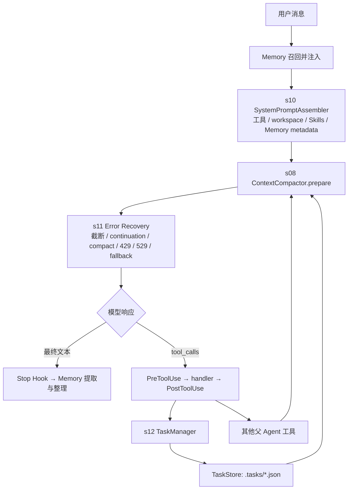

# s12 AgentHarness 调用图

> 本图只表达稳定的调用关系，不绑定易漂移的源码行号。

关键边界：

- s10 从真实注册表组装提示词，不声明不存在的工具；
- s11 只包围模型 API 调用，所有恢复分支都有次数上限；
- s12 六个任务工具只注册给父 Agent；
- TaskStore 负责持久图和状态机，异常转换成模型可读观察；
- Task、Memory、Compact transcript 是互相独立的持久层。
