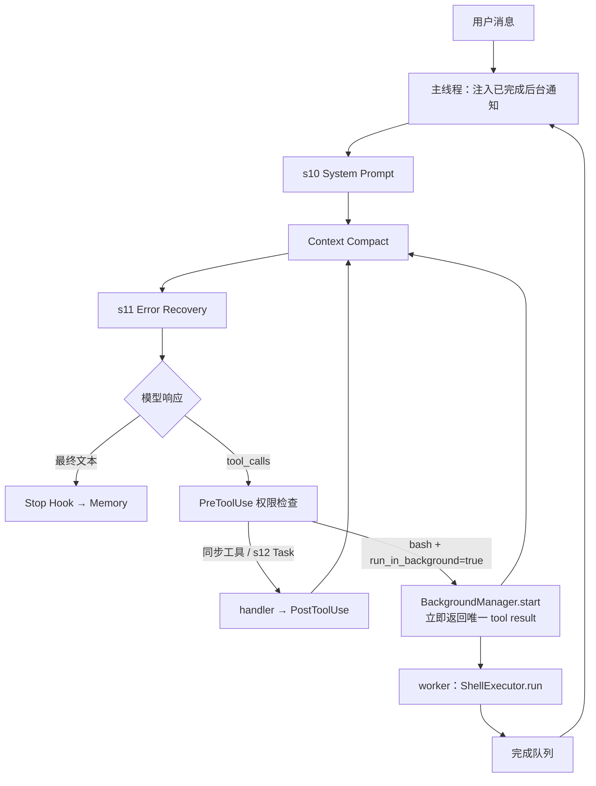

# s13 AgentHarness 调用图

> s13 在 s12 累计链路上增加后台 Bash；worker 永不直接修改消息历史。

关键边界：

- 权限检查发生在线程启动之前；
- 子 Agent 的 Bash schema 没有 `run_in_background`；
- 原 `tool_call_id` 只对应启动占位结果；
- 完成结果以转义后的 `role=user` 运行时通知注入；
- 通知进入当前上下文和 Compact，但不进入 Memory 提取快照；
- 后台完成采用轮询收集，不会主动唤醒已结束的 Agent Loop。
