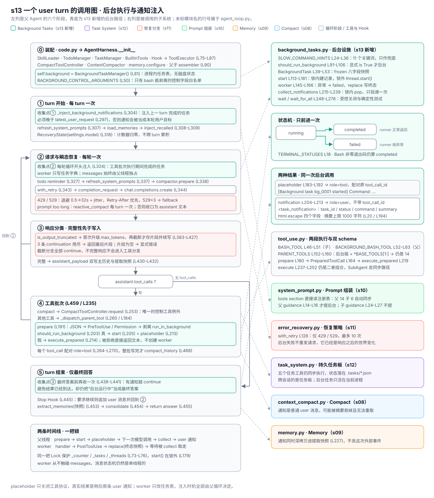

# s13 Background Tasks 调用图

> 配套 [README.md](./README.md) 与 [ANALYSIS.md](./ANALYSIS.md) 阅读。
> 本图描述 s13 新增的后台执行如何接入 [harness/agent_loop.py](./harness/agent_loop.py)
> 中的 `agent_loop`（L288-L469），按"装配 → turn 开始 → 请求与瞬态恢复 → 响应分类 →
> 工具批次 → turn 结束"六段组织，再单独展开后台分发、通知渲染与收集注入三条路径。
> 未标模块名的行号属于 `agent_loop.py`，后台侧行号属于 `background_tasks.py`。

图例：🟦 Background Tasks（s13 新增）；🟣 Task System（s12）；🔴 恢复分支（s11）；
🟢 Prompt 组装（s10）；🟠 Memory 子系统（s09）；🔵 Compact 子系统（s08）；
⬜ 循环阶段、工具与 Hook。

## 总览



图与本文档同构：左列自上而下是父 Agent 的六个阶段，左下是两条时间线，右列是被调用
的子系统。

| 区域 | 内容 | 对应代码 |
| --- | --- | --- |
| 左列 ⓪–⑤ | 装配 → turn 开始 → 请求与瞬态恢复 → 响应分类 → 工具批次 → turn 结束 | L56-L127、L288-L469 |
| 左列青底行 | s13 的四处改动：装配任务表、三个收集点、后台分发 | L50 / L81 / L304 / L324 / L184-L214 / L438-L441 |
| 左下时间线 | 父线程与 worker 各自能做的事，以及唯一的共享锁 | L133-L181、L215-L239 |
| 右列上三块 | 后台设施自身：模块结构、状态机、两种结果 | L13-L282 |
| 右列下六块 | 复用子系统：两段执行、s10 Prompt、s11 恢复、s12 任务板、s08 Compact、s09 Memory | tool_use.py L180 等 |

配色沿用前几章约定：青色是 s13 新增的后台路径，紫色是 s12 持久任务板，红色是 s11
恢复分支，绿色 / 橙色 / 蓝色分别是 Prompt、Memory、Compact 子系统，灰色是循环阶段与
工具 / Hook，白框是判定节点与单个任务状态。虚线箭头表示"阶段调用子系统"。
底部一行提示最容易混淆的边界：placeholder 只负责关闭工具协议，真实结果是稍后那条
user 通知。

## 六个阶段的要点

### ⓪ 装配：多出一行，没多出一个子系统

| 调用 | 位置 | 作用 |
|---|---|---|
| `SkillLoader` / `TodoManager` | L75-L76 | 先建有状态能力 |
| `assert_inside_workdir` → `TaskManager` | L77-L80 | 🟣 磁盘任务板，目录先过边界校验 |
| `BackgroundTaskManager()` | L81 / L56 | 🟦 进程内任务表，无磁盘状态、无构造参数 |
| `BuiltinTools` | L82 | 文件与 Bash handler，后台执行的实际被调方 |
| `install_default_hooks` → `ToolExecutor` | L85-L87 | Hook 必须早于执行器 |
| `CompactToolController` / `ContextCompactor` | L90-L96 | 🔵 控制面与算法面分离 |
| `memory.configure(settings)` | L98 | 🟠 绑定模块级 Memory 到本 Harness |
| 父 / 子 `SystemPromptAssembler` | L101-L106 | 🟢 父 guidance 才包含后台指引 |
| `SubagentRunner(prompt_supplier=…)` | L114-L120 | 子 Agent 只拿 `builtins.handlers()` |
| `_parent_handlers` | L122-L127 | 后台执行复用同一张父 handler 表 |
| `BACKGROUND_CONTROL_ARGUMENTS` | L50 | 🟦 只有 `bash` 会被剥离的控制字段白名单 |

装配阶段的隔离与 s12 同构，只是这次落在 schema 上：`BACKGROUND_BASH_TOOL` 只进
`PARENT_TOOLS`（tool_use.py L152-L160），决定模型**看不看得到** `run_in_background`；
`_parent_handlers`（L122-L127）决定伪造调用**能不能真的执行**。SubAgent 两处都拿不到
后台能力。

### ① turn 开始：收集点①，每 turn 恰好一次

| 调用 | 位置 | 作用 |
|---|---|---|
| `latest_user_request` | L297 / context_compact.py L343 | 先固定本 turn 目标 |
| `copy.deepcopy(messages[-12:])` | L301 | 🟠 建立提取快照 |
| `_inject_background_notifications` | L304 / L216 | 🟦 **收集点①**：上一 turn 之后完成的任务 |
| `refresh_system_prompts(messages)` | L307 | 🟢 把最新 Prompt 写回 `messages[0]` |
| `memory.load_memories` / `inject_recalled_memories` | L308-L309 | 🟠 side-query 召回并附加 |
| `compactor = compactor or self.compactor` | L313 | 🔵 测试可注入替代压缩器 |
| `RecoveryState(settings.model)` | L318 / error_recovery.py L31 | 🔴 恢复额度归零 |

顺序是硬约束：通知的 role 是 `user`，必须在 `active_request` 固定之后才注入，否则
`<task_notification>` 会被 `latest_user_request` 当成本轮用户目标，压缩摘要也会跟着
跑偏。收集点①晚于快照建立（L301），所以通知既进主历史也进快照。

### ② 请求与瞬态恢复：收集点②，每次循环一次

| 调用 | 位置 | 作用 |
|---|---|---|
| `_inject_background_notifications` | L324 / L216 | 🟦 **收集点②**：工具批次期间完成的任务 |
| todo reminder 检查 | L327-L334 | 连续 3 轮未 `todo_write` 注入提醒 |
| `refresh_system_prompts(messages)` | L337 | 🟢 反映本轮工具、Skill、Memory 状态 |
| `compactor.prepare` | L338 / context_compact.py L315 | 🔵 L3 → L1 → L2 → L4 |
| `_visible_parent_tools` | L339 / L168 | 本 turn 压缩过就不再暴露 `compact` |
| `with_retry(fn, recovery, fallback)` | L343 / error_recovery.py L126 | 🔴 429 / 529 最多 10 次 |
| ↳ `provider.completion_request` | L345 / provider.py L32 | 收口 `model` 与 `max_tokens` |
| `is_prompt_too_long_error` | L361-L364 / error_recovery.py L75 | 🔴 与瞬态错误分开判定 |
| `_append_failure_result` | L374-L376 / L273 | 🔴 其余异常收口为最终 assistant 文本 |

注入一定在压缩之前（L324 → L338）：通知先进历史，预算估算才能看到它。恢复分支全部
以 `continue` 回到循环顶部，因此每次重试都会重新经过收集点②——重放请求不会漏掉在
退避等待期间完成的任务，也不会重复投递（终态任务已被 `pop`）。

### ③ 响应分类：完整性检查先于任何历史写入

| 调用 | 位置 | 作用 |
|---|---|---|
| `response.choices[0]` / `choice.message` | L378-L379 | 取本轮响应 |
| `is_output_truncated(finish_reason)` | L383 / error_recovery.py L92 | 🔴 `length` 与 `max_tokens` 都算截断 |
| 首次截断：升级 `max_tokens` 并重放 | L383-L427 | 🔴 丢弃片段，用原历史重放 |
| 已升级：保存纯文本片段 + continuation | L383-L427 | 🔴 最多 3 条续写提示 |
| `assistant_payload` | L430-L432 / provider.py L23 | 完整消息才双写主历史与快照 |

截断分支都在 `assistant_payload()` 之前 `continue`，所以半个 `run_in_background`
参数永远不会进入分发——不完整的响应不可能启动一个无人认领的 worker。

### ④ 工具批次：分发点从一段变成两段

| 调用 | 位置 | 作用 |
|---|---|---|
| `_execute_tool_batch` | L459 / L235 | 只维护协议与分发，返回控制信号 |
| ↳ `CompactToolController.request` | L253 / context_compact.py L364 | 🔵 唯一的控制工具例外 |
| ↳ `_dispatch_parent_tool` | L260 / L184 | 🟦 权限先行，再选前台或后台 |
| ↳ `ToolExecutor.prepare` | L191 / tool_use.py L180 | 父线程：JSON → PreToolUse → 剥离控制字段 |
| ↳ `PermissionPolicy.check` | hooks.py L70 / permission.py L73 | 非 None 即短路，不创建 worker |
| ↳ `should_run_background` | L203 / L91 | 🟦 显式布尔优先，其次慢命令启发式 |
| ↳ `BackgroundTaskManager.start` | L205-L212 / L113 | 🟦 建记录 → 起 daemon 线程 → 返回 `bg_id` |
| ↳ `placeholder` | L213 / L183 | 🟦 当轮的 `role=tool` 内容 |
| ↳ `execute_prepared`（前台） | L214 / tool_use.py L219 | handler → PostToolUse，父线程内完成 |
| `role=tool` 双写 | L264-L270 | 每个 `tool_call_id` 都要有且只有一个结果 |
| `compactor.compact_history` | L466-L469 / context_compact.py L274 | 🔵 批次收尾才真正改写历史 |

后台调用与前台调用共享同一份解析和同一次授权：`start()` 收到的 `runner` 是
`lambda: self.executor.execute_prepared(prepared)`（L209-L211），闭包里就是刚才那个
`PreparedToolCall`。因此"后台"只改变谁在什么时候调用 handler，不改变调用什么。

### ⑤ turn 结束：收集点③，可能把 turn 再拉长一轮

| 调用 | 位置 | 作用 |
|---|---|---|
| `_inject_background_notifications` | L438-L441 / L216 | 🟦 **收集点③**：有通知则 `continue` |
| `hooks.trigger("Stop")` | L445 | 返回非 None 则追加 user 消息并回到 ② |
| `memory.extract_memories` | L453 / memory.py L425 | 🟠 输入是快照，含已注入的通知 |
| `memory.consolidate_memories` | L454 / memory.py L476 | 🟠 ≥10 条合并到 ≤8 条 |
| `return answer` | L455 | 正常出口 |

收集点③是三处里唯一改变控制流的：模型已经决定不再调工具，但任务可能刚好在这次推理
期间完成。有通知就多花一次模型调用，避免把"还在后台运行"当成最终答案。它排在 Stop
Hook 之前，因此后台结果永远比 Stop 续写更早被看到。

三个非正常出口都不触发 Memory 提取，也不再收集通知：`_append_failure_result` 返回、
continuation 上限返回、第二次 prompt 溢出。此时未完成的 worker 会随进程结束而丢弃。

## 后台模块调用关系

```text
agent_loop.py
├─ BackgroundTaskManager()                     L81      background_tasks.py L56
│  ├─ _lock / _counter / _tasks / _threads               L73-L76
│  └─ summary_chars 必须为正                             L66-L67
├─ _dispatch_parent_tool                       L184
│  ├─ ToolExecutor.prepare                     L191     tool_use.py L180
│  │  ├─ json.loads / 非 object                          tool_use.py L190-L195
│  │  ├─ ToolRequest → PreToolUse → Permission           tool_use.py L200-L204
│  │  └─ drop_arguments 过滤 → PreparedToolCall           tool_use.py L206-L217
│  ├─ should_run_background                             L91-L106
│  │  └─ is_slow_operation → SLOW_COMMAND_HINTS          L78-L89 / L24-L36
│  ├─ start(runner=lambda: execute_prepared)   L205    L113-L181
│  │  ├─ tool_name / command 校验                        L126-L129
│  │  ├─ with _lock: _next_id → BackgroundTask           L133-L143
│  │  ├─ worker 闭包：runner → 终态 replace                L145-L166
│  │  └─ Thread(daemon, name=cc-background-…) → start()  L168-L179
│  ├─ placeholder                              L213     L183-L192
│  └─ ToolExecutor.execute_prepared（前台）      L214     tool_use.py L219-L235
└─ _inject_background_notifications             L216
   ├─ collect_notifications                              L215-L239
   │  ├─ with _lock: 选终态 → pop → 清理 _threads          L220-L228
   │  └─ _format_notification → html.escape               L204-L213
   │     └─ _result_summary（1000 字符上限）                L194-L202
   └─ messages / extraction_messages 双写                 L224-L227
```

## 三条内部路径

### 后台分发

```text
tool_call(bash, {command, run_in_background})
  → drop_arguments = {run_in_background}（仅 bash）      L188-L190
  → prepare：JSON → 打印 → PreToolUse / Permission        tool_use.py L190-L204
      └─ 返回 str → 立即作为 tool result，无 worker        L197-L200
  → should_run_background(request.arguments)              L203
      ├─ 非 bash / 显式 false            → 前台
      ├─ 显式 true                       → 后台
      └─ 未提供 → 命中慢命令关键词        → 后台
  → start：锁内建记录，锁外 thread.start()                 L205 / L133-L179
  → placeholder(bg_id, command) 作为 role=tool             L213
```

权限先于线程，所以被拒绝的命令不会留下 `bg_` 记录；判定读的是未剥离的原始参数
（L202），所以 `run_in_background` 还在，而 Bash handler 收到的字典里已经没有它。

### 通知渲染

```text
worker 结束 → replace(status, result, finished_at)        L156-L166
collect_notifications                                     L215
  → 锁内：status ∈ {completed, failed} → sorted → pop      L220-L226
  → 锁内：_threads.pop                                     L227-L228
  → 锁外：_format_notification                             L204-L213
        ├─ _result_summary：>1000 字符 → 截断 + 省略提示     L194-L202
        └─ html.escape(task_id / status / command / summary) L208-L211
  → 锁外：打印 [background done] …                          L234-L238
```

锁内只做字典操作，渲染和打印都在锁外，因此持锁时间与输出长度无关。移除即"已投递"，
不需要额外的 `notified` 标记。

### 收集与注入

```text
_inject_background_notifications(messages, extraction_messages)   L216
  → collect_notifications()                                       L223
  → 每条通知 {"role": "user", "content": …}
        ├─ messages.append                                        L226
        └─ extraction_messages.append(deepcopy)                   L227
  → 有通知则打印 [background inject] N notification(s)              L228-L232
  → return len(notifications)                                     L233
```

返回条数使调用点可以据此改变控制流；只有收集点③（L438-L441）用到了这个返回值。

## 两条时间线

| 动作 | 父线程 | worker 线程 `cc-background-bg_XXXX` |
| --- | --- | --- |
| JSON 解析与打印 | ✔ tool_use.py L190-L199 | — |
| PreToolUse / Permission | ✔ tool_use.py L201-L204 | — |
| handler 执行 | 仅前台调用 | ✔ tool_use.py L226 |
| PostToolUse | 仅前台调用 | ✔ tool_use.py L233 |
| 写 `_tasks` 终态 | — | ✔ L157-L166（持锁） |
| `collect_notifications` | ✔ L215（持锁） | — |
| 追加 `messages` | ✔ L224-L227 | 从不 |
| 触发 Compact / Memory | ✔ L338 / L453 | 从不 |

`thread.start()` 在锁外（L179），而 worker 结束时要重新获得同一把不可重入的锁
（L157）；`_threads[bg_id]` 已在锁内登记（L176），所以 `wait()` 不会看到"任务存在但
线程缺失"的窗口。

## 错误与边界

| 位置 | 检查 | 失败输出 |
| --- | --- | --- |
| `BackgroundTaskManager.__init__` | `summary_chars` 必须为正 | 构造时 `ValueError`（L66-L67） |
| `start` | 只有 `bash` 能后台；command 非空 | `ValueError`（L126-L129） |
| `ToolExecutor.prepare` | arguments 必须是 JSON object | `Error:` observation（tool_use.py L192-L195） |
| `ToolExecutor.prepare` | PreToolUse / Permission 阻断 | 拒绝文本作为 tool result（tool_use.py L201-L204） |
| `execute_prepared` | 工具名未注册 | `Error: unknown tool …`（tool_use.py L222-L223） |
| `execute_prepared` | handler 形参不匹配 | `Error: invalid arguments …`（tool_use.py L227-L231） |
| `worker` | runner 抛出任何异常 | `status=failed` + `Error: background task raised …`（L149-L154） |
| 任务 handler | 输入、状态、依赖、IO | 🟣 `Error:` observation（task_system.py L432-L441） |
| s11 `with_retry` | 429 / 529 等模型请求失败 | 🔴 重试 / fallback（error_recovery.py L126） |
| Permission / Hooks | 工具生命周期策略 | 阻止或观察（permission.py L73 / hooks.py L70） |

后台失败不会进入 Error Recovery：它已经是一次成功模型响应之后的世界状态变化，模型
应据此调整计划，而不是重发模型 API 请求。

## 依赖层

| 层 | 模块 | 内部依赖 |
|---|---|---|
| L0 | `config.py`、`models.py`、`system_prompt.py`、`error_recovery.py`、`task_system.py`、`background_tasks.py` | 无 |
| L1 | `provider.py`、`permission.py`、`skill_loading.py`、`todo_write.py` | L0 |
| L2 | `hooks.py`（→ `permission`）、`memory.py`（→ `skill_loading`） | L0-L1 |
| L3 | `tool_use.py`（→ `hooks`、`task_system`）、`context_compact.py`（→ `hooks`） | L0-L2 |
| L4 | `subagent.py`（→ `tool_use`） | L0-L3 |
| L5 | `agent_loop.py` | L0-L4，composition root |

课程编号是学习顺序，不是依赖层级：`background_tasks.py` 是第十三课，却因为只导入
`html` / `threading` / `time` 等标准库而位于最底层，连 `models.py` 都不依赖。它不知道
`ToolExecutor`、`ToolRequest` 或 `messages` 的存在，只接受一个 `runner: () -> str`。

## 后台任务生命周期示例

```text
轮 1  bash(pytest, run_in_background=true)
        → prepare 通过 → start → bg_0001 running
        → role=tool: [Background task bg_0001 started] …
轮 2  收集点② → 无终态任务 → 模型继续读文件
      worker 结束 → _tasks[bg_0001] = completed
轮 3  收集点② → pop bg_0001 → role=user: <task_notification>
        → 模型据此给出最终答案
轮 3' 若模型在轮 3 就要收尾，收集点③ 会先注入再 continue
```

`snapshot()`（L241-L246）只能看到还在 `running` 的任务：已投递的记录在 `pop` 那一刻
就离开了字典。它服务于状态展示与测试断言，不是历史账本。

## 三条贯穿性线索

1. **消息列表始终单线程可写。** worker 只更新 `_tasks`（L157-L166），三个收集点
   （L304 / L324 / L438-L441）都在父线程的模型调用边界。代价是通知无法打断正在进行
   的模型请求，延迟上限是一次模型调用；收益是 Compact（L338）与 Memory（L453）不需要
   考虑任何并发。
2. **权限与执行分属两个阶段。** `prepare()`（tool_use.py L180-L217）在父线程完成
   解析、PreToolUse 与控制字段剥离，`execute_prepared()`（tool_use.py L219-L235）
   才在前台或 worker 中调用 handler。被拒绝的调用没有 worker、没有 `bg_id`、没有通知
   （L197-L200），测试直接断言两个 Hook 各自的线程名（test_s13.py L970 / L1011）。
3. **一个 tool_call 只有一个结果。** placeholder（L183-L192）当轮闭合协议，真实结果
   以独立 `role=user` 通知出现（L204-L213 / L224-L227），既不复用 `tool_call_id`，也
   不在通知里公开 `original_tool_call_id`。这条约束同时解释了为什么需要 placeholder、
   为什么通知要转义（L205），以及为什么终态任务必须 `pop`（L226）。
