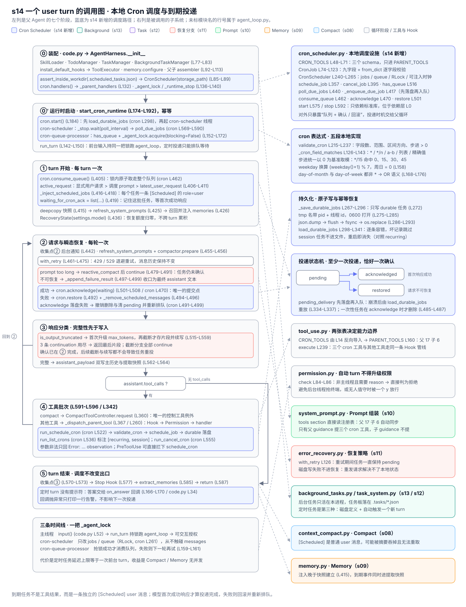

# s14 Cron Scheduler 调用图

> 本图描述 s14 新增的本地 Cron 调度如何接入 [harness/agent_loop.py](./harness/agent_loop.py)
> 中的 `agent_loop`（L395-L601），按"装配 → 运行时启动 → turn 开始 → 请求与瞬态恢复 →
> 响应分类 → 工具批次 → turn 结束"组织，再单独展开调度落盘、轮询入队与投递确认三条
> 路径。未标模块名的行号属于 `agent_loop.py`，调度侧行号属于
> [harness/cron_scheduler.py](./harness/cron_scheduler.py)。

图例：🟦 Cron Scheduler（s14 新增）；🟩 Background Tasks（s13）；🟣 Task System（s12）；
🔴 恢复分支（s11）；🟢 Prompt 组装（s10）；🟠 Memory 子系统（s09）；🔵 Compact 子系统（s08）；
⬜ 循环阶段、工具与 Hook。

## 总览



图与本文档同构：左列自上而下是父 Agent 的阶段，左下是三条时间线，右列是被调用的子系统。

| 区域 | 内容 | 对应代码 |
| --- | --- | --- |
| 左列 ⓪–⑤ | 装配 → 运行时启动 → turn 开始 → 请求与恢复 → 工具批次 → turn 结束 | L58-L203、L395-L601 |
| 左列蓝底行 | s14 的五处改动：装配调度器、两个运行时线程、到期注入、确认、回滚 | L85-L89 / L136-L140 / L174-L203 / L403-L419 / L492-L508 |
| 左下时间线 | 主线程、`cron-scheduler`、`cron-queue-processor` 各自能做的事 | L142-L172、cron L569-L590 |
| 右列上四块 | 调度设施自身：模块结构、表达式匹配、持久化、投递状态机 | cron L18-L607 |
| 右列下六块 | 复用子系统：Permission、s13 后台、s10 Prompt、s11 恢复、s08 Compact、s09 Memory | permission.py L84 等 |

配色沿用前几章约定：蓝色是 s14 新增的调度路径，青绿色是 s13 后台任务，紫色是 s12 持久
任务板，红色是 s11 恢复分支，绿色 / 橙色 / 蓝灰分别是 Prompt、Memory、Compact，灰色是
循环阶段与工具 / Hook。虚线箭头表示"阶段调用子系统"。底部一行提示最容易混淆的边界：
到期任务是一条独立的 `role=user` 事件，模型首次成功响应才算投递完成。

## 各阶段的要点

### ⓪ 装配：多一个有状态能力，多一把串行锁

| 调用 | 位置 | 作用 |
|---|---|---|
| `SkillLoader` / `TodoManager` | L77-L78 | 先建无外部状态的能力 |
| `assert_inside_workdir` → `TaskManager` | L79-L82 | 🟣 磁盘任务板 |
| `BackgroundTaskManager()` | L83 | 🟩 进程内后台任务表 |
| `assert_inside_workdir(.scheduled_tasks.json)` | L86-L88 | 🟦 存储路径先过工作区边界校验 |
| `CronScheduler(storage_path)` | L85-L89 / cron L243 | 🟦 任务定义 + 队列 + `RLock`，此时还没有线程 |
| `install_default_hooks` → `ToolExecutor` | L92-L94 | Hook 必须早于执行器 |
| `memory.configure(settings)` | L105 | 🟠 绑定模块级 Memory |
| 父 / 子 `SystemPromptAssembler` | L108-L113 | 🟢 只有父 guidance 提到三个 cron 工具 |
| `**self.cron.handlers()` | L132 / cron L560 | 🟦 三个 handler 进入父表，SubAgent 拿不到 |
| `_agent_lock` / `_runtime_lock` / `_runtime_stop` | L136-L140 | 🟦 前台 turn 与定时 turn 的串行边界 |

隔离与 s12 / s13 同构，落在两张表上：`CRON_TOOLS`（cron L48-L71）经 `tool_use.py` L14 导入
后只进 `PARENT_TOOLS`（tool_use.py L160），决定模型**看不看得到** `schedule_cron`；
`_parent_handlers`（L129-L135）决定伪造调用**能不能真的执行**。父 17 个工具、子 6 个，
SubAgent 两处都拿不到调度能力。

### ⓪′ 运行时启动：两个线程，一把非阻塞锁

| 调用 | 位置 | 作用 |
|---|---|---|
| `start_cron_runtime(messages, on_answer)` | L174-L192 / code.py L48 | 🟦 幂等：线程存活就直接返回（L182-L183） |
| ↳ `CronScheduler.start()` | L184 / cron L575 | 🟦 先 `load_durable_jobs`，再起 `cron-scheduler` |
| ↳ `load_durable_jobs()` | cron L298-L341 | 🟦 恢复持久任务，`pending_delivery` 的重新入队 |
| ↳ `Thread(cron-scheduler, daemon)` | cron L584-L590 | 🟦 每 `poll_interval` 秒调用 `poll_due_jobs` |
| ↳ `Thread(cron-queue-processor, daemon)` | L186-L192 | 🟦 只在 Agent 空闲时消费队列 |
| `_queue_processor_loop` | L152-L172 | 🟦 `has_queue` + `acquire(blocking=False)` 双重检查 |
| `run_turn` | L142-L150 / code.py L61 | 🟦 前台输入持 `_agent_lock` 跑 `agent_loop` |
| `stop_cron_runtime` | L194-L203 / cron L592 | 🟦 停两个线程，磁盘定义保留 |

顺序是硬约束：`load_durable_jobs` 在起线程之前（cron L578-L582），轮询不会看到只加载了
一半的任务表；`_queue_processor_loop` 用非阻塞 `acquire`，因此定时任务永远排在前台 turn
之后，而不是打断它（测试 test_s14.py L1386 直接持锁断言 0 次模型请求）。

### ① turn 开始：先取队列，再决定 active_request

| 调用 | 位置 | 作用 |
|---|---|---|
| `cron.consume_queue()` | L405 / cron L462 | 🟦 原子取走整个队列，锁内清空 |
| `active_request` 选择 | L406-L411 | 🟦 显式用户请求 > 调度 prompt > `latest_user_request` |
| `copy.deepcopy(messages[-12:])` | L415 | 🟠 建立提取快照 |
| `_inject_scheduled_jobs` | L416-L418 / L311-L326 | 🟦 每个任务一条 `[Scheduled] …` 的 `role=user` |
| `waiting_for_cron_ack = list(...)` | L419 | 🟦 记住这批任务，等首次成功响应再确认 |
| `_inject_background_notifications` | L422 / L292 | 🟩 s13 收集点①，仍在 `active_request` 固定之后 |
| `refresh_system_prompts(messages)` | L425 | 🟢 把最新 Prompt 写回 `messages[0]` |
| `memory.load_memories` / `inject_recalled_memories` | L426-L427 | 🟠 side-query 召回并附加 |
| `RecoveryState(settings.model)` | L436 / error_recovery.py L31 | 🔴 恢复额度归零 |

调度 prompt 只在 `active_request is None` 时才被采用（L406）：前台 `run_turn` 一定会传入
人类请求，所以同一 turn 里同时有用户输入和到期任务时，压缩摘要的目标仍是人类请求
（test_s14.py L1365）。注入晚于快照建立（L415），因此 `[Scheduled]` 事件既进主历史也进
Memory 提取快照。

### ② 请求与瞬态恢复：确认或回滚，只在这一段发生

| 调用 | 位置 | 作用 |
|---|---|---|
| `_inject_background_notifications` | L442 / L292 | 🟩 s13 收集点②，每轮循环一次 |
| `refresh_system_prompts` / `compactor.prepare` | L455-L456 | 🟢🔵 先写 Prompt 再按预算压缩 |
| `with_retry(...)` | L461-L475 / error_recovery.py L126 | 🔴 429 / 529 最多 10 次，消息历史不变 |
| `reactive_compact` 分支 | L479-L491 | 🔴 prompt 溢出：压缩后 `continue`，任务仍未确认 |
| `cron.restore(waiting_for_cron_ack)` | L492-L493 / cron L501 | 🟦 不可恢复错误：重新排队 |
| `_remove_scheduled_messages` | L494-L496 / L328-L340 | 🟦 同时撤掉主历史与快照里的注入 |
| `_append_failure_result` | L497-L499 / L380 | 🔴 收口为最终 assistant 文本 |
| `cron.acknowledge(waiting_for_cron_ack)` | L501-L508 / cron L470 | 🟦 首次成功响应 = 投递完成 |

确认点选在"provider 返回"而不是"turn 结束"：turn 后续还可能截断、还可能耗尽续写次数，
但 prompt 已经进了模型上下文，重投就会重复执行。反过来，首次请求彻底失败时任务必须回到
队列并抹掉注入，否则历史里留着一条永远不会被响应的 `[Scheduled]` 消息（test_s14.py
L1343）。`acknowledge` 内部的落盘失败会整体回滚并重新排队（cron L488-L498），因此这里只
打印告警而不再改控制流。

### ③ 响应分类与 ④ 工具批次：与 s13 完全一致

| 调用 | 位置 | 作用 |
|---|---|---|
| `is_output_truncated` 分支 | L515-L559 | 🔴 截断先升级预算，再存片段 + continuation |
| `assistant_payload` | L562-L564 | 完整消息才双写主历史与快照 |
| `_execute_tool_batch` | L591-L596 / L342 | 只维护协议与分发，返回控制信号 |
| ↳ `CompactToolController.request` | L360 | 🔵 唯一的控制工具例外 |
| ↳ `_dispatch_parent_tool` | L367 / L260 | 🟩 权限先行，再选前台或后台 |
| ↳ `run_schedule_cron` / `run_list_crons` / `run_cancel_cron` | cron L522 / L536 / L555 | 🟦 与其他工具同路：Hook + Permission + handler |
| `compactor.compact_history` | L598-L601 | 🔵 整批结果写完才改写历史 |

三个 cron 工具没有任何特权路径：它们经 `ToolExecutor.execute`（tool_use.py L239）走同一
条 Hook 与权限管线，参数非法时以 `Error: …` observation 返回（cron L522-L534），
`schedule_cron` 因此可以被 PreToolUse Hook 拦下（test_s14.py L1295）。

### ⑤ turn 结束：调度不改变出口

| 调用 | 位置 | 作用 |
|---|---|---|
| `_inject_background_notifications` | L570-L573 | 🟩 s13 收集点③，有通知则 `continue` |
| `hooks.trigger("Stop")` | L577 | 返回非 None 则追加 user 消息并回到 ② |
| `memory.extract_memories` | L585 / memory.py L425 | 🟠 快照里含 `[Scheduled]` 事件 |
| `return answer` | L587 | 正常出口 |
| `on_answer(answer)` | L166-L170 / code.py L34 | 🟦 定时 turn 的答案通过回调打印 |

定时 turn 与前台 turn 走同一个 `agent_loop`，所以 Stop Hook、Memory 提取、Compact 全部
照旧生效。唯一区别是没有人在等提示符：答案交给 `on_answer` 回调，回调抛异常只打印一行
告警（L169-L170），不影响下一次投递。

## Cron 模块调用关系

```text
agent_loop.py
├─ CronScheduler(storage_path)                 L85-L89   cron_scheduler.py L243
│  ├─ storage_path.resolve()                              cron L251
│  └─ jobs / queue / RLock / _stop / _thread              cron L257-L265
├─ start_cron_runtime                          L174
│  ├─ cron.start()                             L184      cron L575-L590
│  │  ├─ load_durable_jobs（幂等）                          cron L298-L341
│  │  │  ├─ json.loads → 必须是 list                        cron L308-L315
│  │  │  ├─ CronJob.from_dict 逐字段校验                     cron L90-L123
│  │  │  └─ pending_delivery → 重新入队                      cron L334-L337
│  │  └─ Thread(cron-scheduler, daemon)                    cron L584-L590
│  │     └─ _scheduler_loop → _stop.wait(interval)         cron L569-L573
│  │        └─ poll_due_jobs                               cron L440-L460
│  │           ├─ cron_matches → _cron_field_matches        cron L146 / L126
│  │           └─ _enqueue_due_job（先落盘再入队）             cron L417-L438
│  └─ Thread(cron-queue-processor, daemon)      L186-L192
│     └─ _queue_processor_loop                 L152-L172
│        ├─ cron.has_queue()                              cron L516
│        ├─ _agent_lock.acquire(blocking=False)  L159-L161
│        └─ agent_loop(messages) → on_answer     L165-L170
├─ agent_loop                                  L395
│  ├─ cron.consume_queue()                     L405      cron L462-L468
│  ├─ _inject_scheduled_jobs                   L416      L311-L326
│  ├─ cron.acknowledge（首次成功响应后）           L505      cron L470-L499
│  ├─ cron.restore（首次请求失败）                 L493      cron L501-L514
│  └─ _remove_scheduled_messages                L494      L328-L340
├─ _parent_handlers ← cron.handlers()          L132      cron L560-L567
│  ├─ run_schedule_cron → schedule_job                    cron L522 / L357
│  ├─ run_list_crons                                      cron L536-L553
│  └─ run_cancel_cron → cancel_job                        cron L555 / L395
└─ stop_cron_runtime                           L194-L203
   ├─ _runtime_stop.set() → queue thread join   L200 / L202-L203
   └─ cron.stop() → _stop.set() → join          L201 / cron L592-L601
```

## 三条内部路径

### 调度与落盘

```text
schedule_cron(cron, prompt, recurring, durable)
  → validate_cron 五段校验                                cron L215-L237
      └─ 非法 → "Error: minute: …" 作为 tool result        cron L522-L534
  → prompt 非空、recurring / durable 必须是真 bool          cron L369-L374
  → with lock: _new_id → CronJob → jobs[id]               cron L376-L384
  → durable → _save_durable_jobs                          cron L267-L296
      ├─ 只写 durable 任务                                  cron L272
      ├─ tmp 名带 pid + 线程 id，0600 打开                   cron L275-L285
      ├─ json.dump → flush → fsync → os.replace            cron L286-L293
      └─ finally unlink(missing_ok=True)                   cron L294-L296
  → OSError → 回滚 jobs.pop，返回 "Could not persist …"     cron L388-L391
```

内存登记与磁盘状态必须同生共死：落盘失败若不回滚，本进程会按一个重启即消失的任务触发
提示（test_s14.py L1254）。`session` 任务（`durable=false`）根本不进文件，`run_list_crons`
用 `[recurring, session]` 把这个区别显式写给模型（cron L544-L552）。

### 轮询与入队

```text
_scheduler_loop：_stop.wait(poll_interval) 既是间隔也是退出信号   cron L569-L573
poll_due_jobs(moment=now_fn())                                cron L440-L460
  → minute_marker = "%Y-%m-%d %H:%M"                          cron L444
  → 跳过 pending_delivery 或 last_fired == marker              cron L449-L452
  → cron_matches(job.cron, moment)                            cron L146-L176
      ├─ validate_cron 不通过 → False（不抛异常）                cron L151-L152
      ├─ weekday 换算：(weekday()+1) % 7                        cron L158
      └─ day / weekday 都非 * → OR 语义                         cron L168-L176
  → _enqueue_due_job：pending=True + last_fired 落盘后再 append  cron L417-L438
      └─ 落盘失败 → 回滚两个字段并抛出，由 poll 打印              cron L432-L437
```

一分钟只触发一次由 `last_fired` 保证，而不是靠"每分钟只轮询一次"：默认 1 秒轮询一次，
同一分钟内的后续 59 次都会被 L451 挡掉，而日期变化后同一表达式可以再次命中
（test_s14.py L1213）。`pending_delivery` 是第二道闸：上一次投递还没确认时不重复入队。

### 投递与确认

```text
consume_queue → [CronJob]                                    cron L462-L468
  → _inject_scheduled_jobs：{"role": "user", "content": "[Scheduled] …"}   L311-L326
        ├─ messages.append                                    L322
        └─ extraction_messages.append(deepcopy)                L323
  → 首次模型请求
        ├─ 成功 → acknowledge                                  L505 / cron L470-L499
        │     ├─ recurring → pending_delivery = False          cron L482-L484
        │     ├─ one-shot  → jobs.pop（此刻才删除）              cron L485-L487
        │     └─ 落盘失败 → 撤销删除与清 pending + restore        cron L491-L499
        └─ 不可恢复失败 → restore + _remove_scheduled_messages   L492-L496
              └─ queued_ids 去重，重复 restore 不会排两次         cron L505-L514
```

投递语义是"至少一次"：`pending_delivery` 先落盘再入队，因此进程在投递与确认之间崩溃时，
下次 `load_durable_jobs` 会把它重新排队（cron L334-L337）。一次性任务在 `acknowledge`
时才删除，而不是在入队时删除（test_s14.py L1226）。

## 三条时间线

| 动作 | 主线程（前台 turn） | `cron-scheduler` | `cron-queue-processor` |
| --- | --- | --- | --- |
| 读 `input()` / 交互授权 | ✔ code.py L52 / permission.py L87 | — | — |
| `poll_due_jobs` → 入队 | 测试可直接调用 | ✔ cron L440（持锁） | — |
| `_save_durable_jobs` | ✔ 工具 handler 内 | ✔ 入队时 | ✔ 确认时 |
| 持 `_agent_lock` | ✔ `run_turn` L149 | 从不 | ✔ 非阻塞 L159-L161 |
| 改写 `messages` | ✔ | 从不 | ✔（持锁时） |
| 触发 Compact / Memory | ✔ L456 / L585 | 从不 | ✔（持锁时） |
| 交互式权限确认 | ✔ | — | ✘ 直接拒绝 permission.py L84-L86 |

`messages` 仍然只有一个写者：`_agent_lock` 保证前台 turn 与定时 turn 不会同时进入
`agent_loop`。调度线程只碰 `jobs` / `queue`（由 `RLock` 保护，cron L261），从不触碰消息
列表；`RLock` 而非 `Lock` 是因为 `poll_due_jobs → _enqueue_due_job → _save_durable_jobs`
会在同一线程内重复取锁。

## 错误与边界

| 位置 | 检查 | 失败输出 |
| --- | --- | --- |
| `validate_cron` | 五段、范围、区间方向、步进 > 0 | 带字段名的错误文本（cron L215-L237） |
| `cron_matches` | 非法表达式 | 返回 `False`，不中断轮询（cron L151-L152） |
| `CronJob.from_dict` | 字段集合、ID 字符集、分钟标记格式 | `ValueError` → 跳过该条记录（cron L90-L123） |
| `load_durable_jobs` | 文件非 JSON list | 打印告警并放弃恢复（cron L308-L315） |
| `_new_id` | `id_factory` 必须返回合法且唯一的 ID | `ValueError` / `RuntimeError`（cron L343-L355） |
| `schedule_job` | prompt 非空；`recurring` / `durable` 是真 bool | `Error:` observation（cron L369-L374） |
| `schedule_job` / `cancel_job` | 落盘失败 | 回滚内存并返回错误文本（cron L388-L391 / L410-L413） |
| `_enqueue_due_job` | 落盘失败 | 回滚字段并抛出，任务不入队（cron L432-L437） |
| `acknowledge` | 落盘失败 | 撤销删除 + `restore` 后抛出（cron L491-L499） |
| `AgentHarness.__init__` | 存储路径必须在工作区内 | `assert_inside_workdir` 抛错（L86-L88） |
| `PermissionPolicy.check` | 非主线程不得交互授权 | `Permission denied: scheduled turns …`（permission.py L84-L86） |
| s11 `with_retry` | 429 / 529 等模型请求失败 | 🔴 重试 / fallback，期间任务保持 pending（error_recovery.py L126） |

调度失败不会进入 Error Recovery：它是模型请求之前或之后的本地状态变化，重发 API 请求
解决不了磁盘写失败。反之，模型请求失败会触发 `restore`，让任务回到队列等下一次投递。

## 依赖层

| 层 | 模块 | 内部依赖 |
|---|---|---|
| L0 | `config.py`、`models.py`、`system_prompt.py`、`error_recovery.py`、`task_system.py`、`background_tasks.py`、`cron_scheduler.py` | 无 |
| L1 | `provider.py`、`permission.py`、`skill_loading.py`、`todo_write.py` | L0 |
| L2 | `hooks.py`（→ `permission`）、`memory.py`（→ `skill_loading`） | L0-L1 |
| L3 | `tool_use.py`（→ `hooks`、`task_system`、`cron_scheduler`）、`context_compact.py`（→ `hooks`） | L0-L2 |
| L4 | `subagent.py`（→ `tool_use`） | L0-L3 |
| L5 | `agent_loop.py` | L0-L4，composition root |

课程编号仍不是依赖层级：`cron_scheduler.py` 是第十四课，却只导入 `json` / `os` / `re` /
`secrets` / `threading` 等标准库，位于最底层。它不知道 `messages`、`ToolExecutor` 或
`AgentHarness` 的存在，对外只暴露"队列 + 确认 / 回滚"三个动作，投递时机完全由父循环决定。

## 定时任务生命周期示例

```text
T0    schedule_cron("*/5 9-17 * * 1-5", "review CI", durable=true)
        → validate → jobs[cron_ab12] → .scheduled_tasks.json (0600)
T1    cron-scheduler：09:05:01 poll → cron_matches → pending=True 落盘 → queue
T2    cron-queue-processor：has_queue 且 _agent_lock 空闲 → agent_loop(messages)
        → messages += {"role": "user", "content": "[Scheduled] review CI"}
        → 首次响应成功 → acknowledge：recurring → pending=False（一次性则删除）
        → turn 正常结束 → on_answer 打印 [scheduled answer]
T2'   若首次请求不可恢复失败 → restore + 移除注入 → 保持 pending 等下一轮
T3    09:05:30 再次 poll → last_fired 命中 → 不重复入队
T4    09:10:00 poll → 新的 minute_marker → 再次入队
```

用户正在输入或前台 turn 正在跑时，T2 会推迟到 `_agent_lock` 释放之后，而不是打断它；
`has_queue` 在拿锁前后各查一次（L159 / L164），避免锁刚拿到时队列已被清空。

## 三条贯穿性线索

1. **消息列表仍然只有一个写者。** 调度线程只改 `jobs` / `queue`，注入与删除都发生在
   `agent_loop` 内（L416 / L494），而 `_agent_lock`（L137）保证前台与定时 turn 串行。
   代价是定时任务的延迟上限等于一次前台 turn，收益是 Compact（L456）与 Memory（L585）
   不需要考虑任何并发。
2. **投递至少一次，确认恰好一次。** `pending_delivery` 先落盘再入队（cron L417-L438），
   崩溃后靠 `load_durable_jobs` 重放（cron L334-L337）；`acknowledge` 是唯一的提交点
   （L505），它自身失败时整体回滚并重新排队（cron L491-L499）。
3. **自动 turn 不得升级权限。** 到期任务只是一条普通 `role=user` 消息，因此完整经过
   Hook、Permission 与工具协议；`permission.py` L84-L86 进一步把非主线程的交互式授权
   直接判为拒绝，避免后台线程抢占终端或在无人值守时被 `y` 放行（test_s14.py L1417）。
