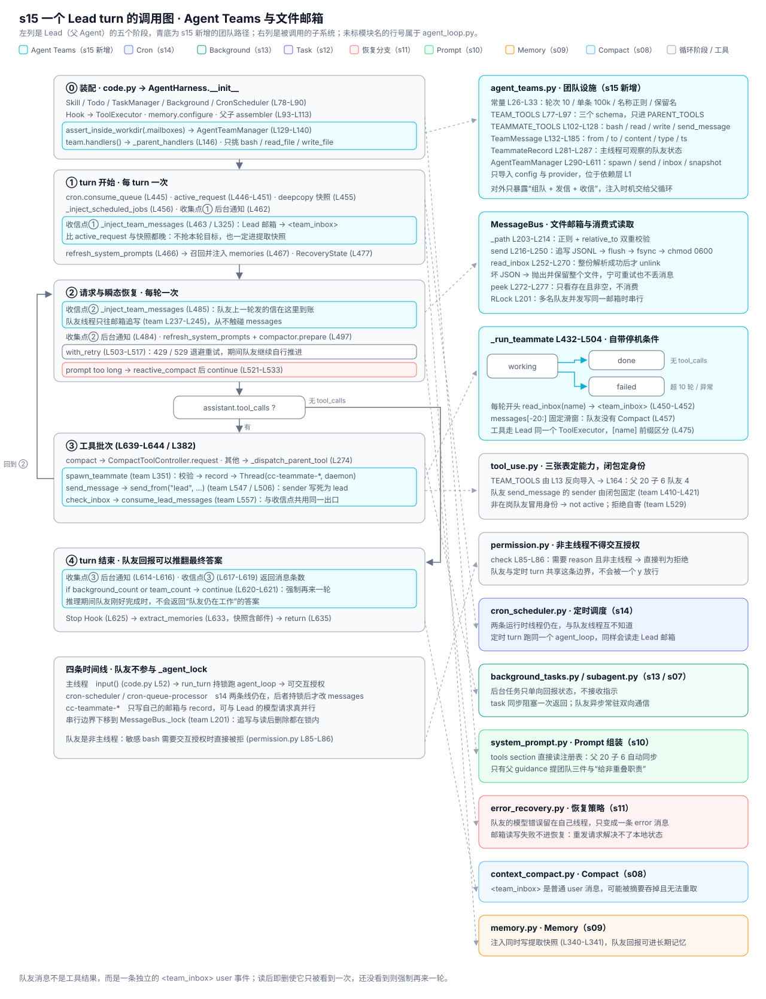

# s15 Agent Teams 调用图

> 本图描述 s15 新增的 Agent Teams 如何接入 [harness/agent_loop.py](./harness/agent_loop.py)
> 中的 `agent_loop`（L435-L650），按“装配 → turn 开始 → 循环内收信 → 工具批次 →
> turn 结束”组织，再单独展开组队、发信与收信三条路径。未标模块名的行号属于
> `agent_loop.py`，标 `team` 的行号属于 [harness/agent_teams.py](./harness/agent_teams.py)。

图例：🟦 Agent Teams（s15 新增）；🟪 Cron Scheduler（s14）；🟩 Background Tasks（s13）；
🟣 Task System（s12）；🔴 恢复分支（s11）；🟢 Prompt 组装（s10）；🟠 Memory 子系统（s09）；
🔵 Compact 子系统（s08）；⬜ 循环阶段、工具与 Hook。

## 总览



图与本文档同构：左列自上而下是 Lead（父 Agent）的阶段，左下是四条时间线，右列是被调用的
子系统。

| 区域 | 内容 | 对应代码 |
| --- | --- | --- |
| 左列 ⓪–④ | 装配 → turn 开始 → 每轮收信 → 工具批次 → turn 结束 | L59-L154、L435-L650 |
| 左列蓝底行 | s15 的四处改动：装配 TeamManager、两个收集点、`team_count` 强制续轮 | L129-L140 / L463 / L485 / L617-L621 |
| 左下时间线 | 主线程、`cron-scheduler`、`cron-queue-processor`、`cc-teammate-*` | L151、team L365-L372 |
| 右列上四块 | 团队设施自身：模块结构、消息校验、文件邮箱、队友循环 | team L26-L611 |
| 右列下六块 | 复用子系统：Permission、s14 Cron、s13 后台、s10 Prompt、s11 恢复、s08/s09 | permission.py L85 等 |

配色沿用前几章约定：蓝色是 s15 新增的团队路径，靛紫是 s14 定时调度，青绿色是 s13 后台任务，
紫色是 s12 持久任务板，红色是 s11 恢复分支，绿色 / 橙色 / 蓝灰分别是 Prompt、Memory、
Compact，灰色是循环阶段与工具 / Hook。虚线箭头表示“阶段调用子系统”。底部一行提示最容易
混淆的边界：队友消息是一条独立的 `role=user` 事件，而不是某个工具的返回值。

## 各阶段的要点

### ⓪ 装配：一个管理器，一个邮箱目录，三个新 handler

| 调用 | 位置 | 作用 |
|---|---|---|
| `SkillLoader` / `TodoManager` | L78-L79 | 先建无外部状态的能力 |
| `TaskManager` / `BackgroundTaskManager` | L83-L84 | 🟣🟩 磁盘任务板与进程内后台表 |
| `CronScheduler(...)` | L86-L90 | 🟪 定时任务定义 + 队列 |
| `install_default_hooks` → `ToolExecutor` | L93-L95 | Hook 必须早于执行器 |
| `sub_handlers = self.builtins.handlers()` | L121 | 父 / 子 / 队友共享的基础工具来源 |
| `assert_inside_workdir(.mailboxes)` | L129-L131 | 🟦 邮箱目录先过工作区边界校验 |
| `AgentTeamManager(...)` | L134-L140 / team L293 | 🟦 只挑走 bash / read_file / write_file（team L309-L313） |
| ↳ `MessageBus(mailbox_dir)` | team L314 / L188 | 🟦 `RLock` + 目录，此时还没有线程 |
| `**self.team.handlers()` | L146 / team L572 | 🟦 三个 handler 进入父表，SubAgent 拿不到 |
| `_agent_lock` | L151 | 🟪 前台 turn 与定时 turn 的串行边界，队友不参与 |

隔离仍然落在两张表上：`TEAM_TOOLS`（team L77-L97）经 `tool_use.py` L13 导入后只进
`PARENT_TOOLS`（tool_use.py L164），决定模型**看不看得到** `spawn_teammate`；
`_parent_handlers`（L142-L149）决定伪造调用**能不能真的执行**。父 20 个工具、子 6 个、
队友 4 个（team L102-L128），SubAgent 与队友都无法再派生新的 Agent
（test_s15.py L1563）。

### ① turn 开始：邮箱与后台通知同一个位置进入历史

| 调用 | 位置 | 作用 |
|---|---|---|
| `cron.consume_queue()` | L445 | 🟪 原子取走到期任务 |
| `active_request` 选择 | L446-L451 | 🟪 显式用户请求 > 调度 prompt > `latest_user_request` |
| `copy.deepcopy(messages[-12:])` | L455 | 🟠 建立提取快照 |
| `_inject_scheduled_jobs` | L456-L458 | 🟪 每个到期任务一条 `[Scheduled] …` |
| `_inject_background_notifications` | L462 | 🟩 s13 收集点① |
| `_inject_team_messages` | L463 / L325 | 🟦 收信点①：Lead 邮箱 → 一条 `<team_inbox>` 事件 |
| `refresh_system_prompts(messages)` | L466 | 🟢 父 guidance 含三个团队工具 |
| `memory.load_memories` / `inject_recalled_memories` | L467-L468 | 🟠 side-query 召回 |
| `RecoveryState(settings.model)` | L477 | 🔴 恢复额度归零 |

收信点晚于 `active_request` 固定（L446）与快照建立（L455）：队友消息因此既不会被当成本轮
用户目标，也一定会进入 Memory 提取快照。它是独立的 `role=user` 事件而非 `role=tool`，
所以不需要配对的 `tool_call_id`，Compact 也可以安全地把它当普通历史处理
（test_s15.py L1778）。

### ② 每轮循环：模型边界是唯一的消费点

| 调用 | 位置 | 作用 |
|---|---|---|
| `_inject_background_notifications` | L484 | 🟩 s13 收集点② |
| `_inject_team_messages` | L485 | 🟦 收信点②：队友上一轮发的信在这里到账 |
| `refresh_system_prompts` / `compactor.prepare` | L497-L498 | 🟢🔵 先写 Prompt 再按预算压缩 |
| `with_retry(...)` | L503-L517 | 🔴 429 / 529 重试，期间队友继续在自己线程里跑 |
| `reactive_compact` 分支 | L521-L533 | 🔴 prompt 溢出：压缩后 `continue` |
| `cron.restore` / `_remove_scheduled_messages` | L534-L538 | 🟪 不可恢复错误时回滚到期任务 |
| `cron.acknowledge(...)` | L543-L550 | 🟪 首次成功响应 = 投递完成 |

队友线程只往邮箱文件追写（team L237-L245），从不触碰 `messages`；父循环在“每次模型请求
之前”统一读走整个邮箱。这样并发写者可以有很多个，消息列表的写者始终只有一个。

### ③ 工具批次：三个团队工具没有特权路径

| 调用 | 位置 | 作用 |
|---|---|---|
| `_execute_tool_batch` | L639-L644 / L382 | 只维护协议与分发，返回控制信号 |
| ↳ `_dispatch_parent_tool` | L274 | 权限先行，再选前台或后台 |
| ↳ `spawn_teammate` | team L351 | 🟦 校验 → 建 record → 起 daemon 线程 |
| ↳ `run_send_message` → `send_from("lead", …)` | team L547 / L506 | 🟦 sender 写死为 `lead` |
| ↳ `run_check_inbox` → `consume_lead_messages` | team L557 / L552 | 🟦 与收信点共用同一个消费出口 |
| `ToolExecutor.execute` | tool_use.py L243 | Hook + Permission + handler 同一条管线 |

`spawn_teammate` 返回的只是一句“已创建”，不阻塞等待结果（team L382）：Lead 要么在后续轮次
被动收到 `<team_inbox>`，要么主动调 `check_inbox`。两条路径背后是同一个
`bus.read_inbox("lead")`，因此同一批消息只会被看到一次（test_s15.py L1771）。

### ④ turn 结束：队友回报可以推翻“最终答案”

| 调用 | 位置 | 作用 |
|---|---|---|
| `_inject_background_notifications` | L614-L616 | 🟩 s13 收集点③ |
| `_inject_team_messages` | L617-L619 | 🟦 收信点③，返回消息条数 |
| `if background_count or team_count: continue` | L620-L621 | 🟦 任一非空就重新进入模型循环 |
| `hooks.trigger("Stop")` | L625 | 返回非 None 则追加 user 消息并回到 ② |
| `memory.extract_memories` | L633 | 🟠 快照里含 `<team_inbox>` 事件 |
| `return answer` | L635 | 正常出口 |

第三个收集点解决的是时序问题：模型推理期间队友可能刚好完成，此时直接返回“队友仍在工作”
就是错的。收到消息则强制再来一轮，让模型看过回报再给答案（test_s15.py L1802）。

## Agent Teams 模块调用关系

```text
agent_loop.py
├─ AgentTeamManager(client, settings, executor, file_handlers, mailbox_dir)  L134-L140  team L293
│  ├─ file_handlers 过滤为 bash / read_file / write_file            team L309-L313
│  ├─ MessageBus(mailbox_dir)                                      team L314 / L188
│  │  ├─ mailbox_dir.resolve()                                     team L197
│  │  └─ clock / RLock                                             team L199-L201
│  └─ _records / _threads（主线程可见的队友状态）                     team L319-L320
├─ agent_loop                                                      L435
│  ├─ _inject_team_messages（收信点 ①②③）                    L463 / L485 / L617
│  │  ├─ team.consume_lead_messages() → bus.read_inbox("lead")     L333 / team L552
│  │  ├─ team.inbox_event(inbox)                                   L339 / team L395
│  │  ├─ messages.append + extraction_messages.append(deepcopy)     L340-L341
│  │  └─ 异常 → 打印告警并返回 0（不中断 turn）                       L334-L336
│  └─ if background_count or team_count → continue                 L620-L621
├─ _parent_handlers ← team.handlers()                              L146      team L572-L579
│  ├─ spawn_teammate                                               team L351-L382
│  │  ├─ _validate_spawn（名称 / 保留名 / role / prompt）             team L323-L336
│  │  ├─ _active_name（重名且在岗则拒绝）                             team L338-L349
│  │  ├─ TeammateRecord(status="working")                          team L363-L364
│  │  └─ Thread(cc-teammate-<name>, daemon)                        team L365-L372
│  │     └─ start 失败 → 回滚 _threads / _records                    team L376-L380
│  ├─ run_send_message → send_from("lead", to, content)            team L547 / L506
│  └─ run_check_inbox → consume_lead_messages                      team L557 / L552
└─ cc-teammate-<name> 线程
   └─ _run_teammate(name, role, prompt)                            team L432-L504
      ├─ system + user 两条私有消息                                 team L438-L444
      ├─ _teammate_system_prompt（不走 SystemPromptAssembler）       team L384-L392
      ├─ _teammate_handlers（闭包固定 sender）                       team L410-L421
      ├─ 每轮：bus.read_inbox(name) → inbox_event                   team L450-L452
      ├─ completion_request(settings, messages[-20:], TEAMMATE_TOOLS) team L453-L461
      ├─ 无 tool_calls → bus.send(name,"lead",summary,"result")      team L464-L473
      ├─ 有 tool_calls → executor.execute(..., display_prefix)      team L475-L490
      ├─ 超 max_rounds → bus.send(... "error") + status=failed      team L492-L494
      └─ 异常 → 同样报一封 error 并落定 failed                       team L495-L504
```

## 三条内部路径

### 组队与队友循环

```text
spawn_teammate(name, role, prompt)
  → _validate_spawn                                        team L323-L336
      ├─ 名称必须匹配 VALID_AGENT_NAME                       team L30 / L326
      ├─ lead / agent 是保留名                               team L33 / L330
      └─ role / prompt 非空                                  team L332-L335
  → with lock: 同名在岗 → "already active"                   team L359-L362
  → _records[name] = TeammateRecord(status="working")        team L363-L364
  → Thread(name="cc-teammate-<name>", daemon=True).start()   team L365-L375
      └─ RuntimeError → 回滚两张表后返回错误文本               team L376-L380
  → 立即返回 "Teammate … spawned"（不等结果）                  team L382
_run_teammate 循环上限 MAX_TEAMMATE_ROUNDS=10                team L26 / L448
  → messages[-20:] 固定滑窗（队友没有 Compact）                team L457
  → TEAMMATE_TOOLS 只有四个 schema                            team L102-L128
```

队友是自治循环：没有任何外部组件轮询它，因此停机条件必须自带——正常完工发 `result`
（team L470），超轮次或抛异常发 `error`（team L493 / L499），三条出口都会把 record 落到
终态（team L423-L430）。轮次上限使失控队友最终收敛成一条可读消息而不是常驻线程
（test_s15.py L1737）。

### 发信与身份校验

```text
send_from(sender, to, content)                              team L506-L545
  → sender 字符集校验                                        team L509-L513
  → sender == "lead" → 归一为 "lead"                          team L514-L515
  → 否则必须是在岗队友（_active_name）                         team L517-L522
  → to 字符集 / content 非空 / 长度 ≤ MAX_MESSAGE_CHARS        team L523-L528
  → to == sender → 拒绝自寄                                   team L529-L531
  → 收件人：lead 或在岗队友，否则 "not active"                  team L533-L539
  → bus.send(sender, recipient, content.strip())             team L541 / L216
      ├─ TeamMessage.from_dict 逐字段校验后才落盘               team L225 / L154-L185
      ├─ mkdir → _path(to) 二次确认目录归属                     team L235-L236 / L203-L214
      ├─ append JSONL → flush → fsync                        team L237-L243
      ├─ chmod 0600                                          team L245
      └─ 打印 [team bus] 审计行                                team L246-L249
  → OSError / ValueError → "Error: could not send message"    team L542-L544
```

两条发信入口共用同一个 `send_from`，区别只在 sender 从哪来：Lead 侧 handler 把它写死为
`lead`（team L547），队友侧由 `_teammate_handlers` 的闭包固定成自己（team L410-L421）。
因此“伪造来源”需要同时绕过闭包与 `_active_name` 的在岗检查，两者都失败时直接返回错误
（test_s15.py L1760）。

### 收信与注入

```text
_inject_team_messages(messages, extraction_messages) -> int   L325-L349
  → team.consume_lead_messages() → bus.read_inbox("lead")     L333 / team L252-L270
      ├─ 文件不存在 → []                                       team L260-L261
      ├─ 整份解析成功后才 unlink                                team L262-L269
      └─ 坏 JSON → 抛出且保留文件（不丢其他消息）                 team L263-L268
  → 异常 → 打印 [team inbox failed] 并返回 0                    L334-L336
  → inbox_event(messages)                                      L339 / team L395-L408
      └─ {"role": "user", "content": "<team_inbox>…JSON…"}      team L399-L408
  → messages.append / extraction_messages.append(deepcopy)      L340-L341
  → 打印 [team inbox] N message(s) from …                       L342-L348
  → 返回条数（供 ④ 判断是否强制续轮）                             L349
```

“读后即删”让投递恰好一次：`read_inbox` 是消费式的，`check_inbox` 与三个收集点共用它，所以
同一条消息不会既出现在工具结果里、又出现在 `<team_inbox>` 里。反过来，任何一行解析失败都
会在 `unlink` 之前抛出，整个邮箱原样保留，宁可重试也不丢消息（test_s15.py L1513）。

## 四条时间线

| 动作 | 主线程（Lead turn） | `cron-scheduler` | `cron-queue-processor` | `cc-teammate-*` |
| --- | --- | --- | --- | --- |
| 读 `input()` / 交互授权 | ✔ code.py L52 | — | — | ✘ permission.py L85-L86 |
| 改写 `messages` | ✔ | 从不 | ✔（持锁时） | 从不（只写邮箱） |
| 写邮箱文件 | ✔ 工具 handler 内 | — | ✔ | ✔ team L237-L245 |
| 读 Lead 邮箱 | ✔ L463 / L485 / L617 | — | ✔（持锁时） | ✘ 只读自己的 |
| 持 `_agent_lock` | ✔ `run_turn` L156-L164 | 从不 | ✔ 非阻塞 L173-L175 | 从不 |
| 触发 Compact / Memory | ✔ L498 / L633 | 从不 | ✔（持锁时） | 从不（用固定滑窗） |
| 可创建新 Agent | ✔ task / spawn_teammate | — | ✔ | ✘ TEAMMATE_TOOLS 里没有 |

队友线程数量不受 `_agent_lock` 限制——它们不碰 `messages`，所以可以与 Lead 的模型请求真正
并行。串行化的边界被下移到 `MessageBus._lock`（team L201）：多名队友并发写同一个邮箱时，
追写与“读后删除”都在同一把 `RLock` 内（test_s15.py L1492）。

## 错误与边界

| 位置 | 检查 | 失败输出 |
| --- | --- | --- |
| `TeamMessage.from_dict` | 字段集合、名称字符集、type 格式、`bool` 不算数字 | `ValueError`（team L154-L185） |
| `MessageBus._path` | 正则 + `relative_to` 双重校验 | `mailbox path escapes directory`（team L203-L214） |
| `MessageBus.send` | 落盘失败 | 由 `send_from` 收口为 `Error:` 文本（team L542-L544） |
| `MessageBus.read_inbox` | 任一行坏 JSON | 抛出且**不删除**邮箱（team L262-L269） |
| `_validate_spawn` | 名称 / 保留名 / role / prompt | `Error: …` observation（team L323-L336） |
| `spawn_teammate` | 同名队友仍在岗 | `already active`（team L359-L362） |
| `spawn_teammate` | `Thread.start()` 失败 | 回滚两张表后返回错误（team L376-L380） |
| `send_from` | 非在岗队友冒用 sender | `teammate sender … is not active`（team L519-L521） |
| `send_from` | 收件人不存在或自寄 | `not active` / `cannot send a message to itself`（team L529-L539） |
| `_run_teammate` | 超过 `max_rounds` | 发 `error` 并 `status=failed`（team L492-L494） |
| `_run_teammate` | 任意异常（含模型错误） | 发 `error`；连发信也失败仍落定 failed（team L495-L504） |
| `_inject_team_messages` | 邮箱读取失败 | 打印告警、返回 0，不影响本轮（L334-L336） |
| `AgentHarness.__init__` | 邮箱目录必须在工作区内 | `assert_inside_workdir` 抛错（L129-L131） |
| `PermissionPolicy.check` | 非主线程不得交互授权 | 队友的敏感 bash 直接被拒（permission.py L85-L86） |

团队通信失败不进入 Error Recovery：它是本地文件与状态校验，重发模型请求解决不了。反过来，
队友自己的模型请求失败**也不会**触发父循环的 `with_retry`——它在独立线程里，只会变成一条
`error` 消息交给 Lead 处置（test_s15.py L1723）。

## 依赖层

| 层 | 模块 | 内部依赖 |
|---|---|---|
| L0 | `config.py`、`models.py`、`system_prompt.py`、`error_recovery.py`、`task_system.py`、`background_tasks.py`、`cron_scheduler.py` | 无 |
| L1 | `provider.py`、`permission.py`、`skill_loading.py`、`todo_write.py`、`agent_teams.py`（→ `config`、`provider`） | L0 |
| L2 | `hooks.py`（→ `permission`）、`memory.py`（→ `skill_loading`） | L0-L1 |
| L3 | `tool_use.py`（→ `hooks`、`task_system`、`cron_scheduler`、`agent_teams`）、`context_compact.py`（→ `hooks`） | L0-L2 |
| L4 | `subagent.py`（→ `tool_use`） | L0-L3 |
| L5 | `agent_loop.py` | L0-L4，composition root |

课程编号仍不是依赖层级：`agent_teams.py` 是第十五课，却位于 L1——它只导入 `config` 与
`provider`，对 `ToolExecutor` 的依赖靠 `TYPE_CHECKING`（team L20-L22）与构造注入解决，
因此 `tool_use.py` 可以反向导入 `TEAM_TOOLS`（tool_use.py L13）而不成环。它不知道
`messages` 或 `AgentHarness` 的存在，对外只暴露“组队 + 发信 + 收信”三个动作。

## 队友生命周期示例

```text
T0    Lead: spawn_teammate("scanner", "log auditor", "统计 ERROR 行数")
        → 校验 → _records["scanner"]=working → Thread(cc-teammate-scanner) 起飞
        → 工具结果立即返回 "Teammate 'scanner' spawned as log auditor"
T1    scanner 第 1 轮：read_inbox("scanner") 为空 → 模型请求 → bash 工具
        → 输出带 [scanner] 前缀，走 Lead 同一条 Hook + Permission 管线
T2    Lead 第 2 轮开头：_inject_team_messages 读到 scanner 的中途汇报
        → messages += {"role": "user", "content": "<team_inbox>…"}
T3    Lead: send_message("scanner", "只看 auth.log") → .mailboxes/scanner.jsonl
        → scanner 下一轮开头 read_inbox 收到（test_s15.py L1669）
T4    scanner 无 tool_calls → bus.send(scanner→lead, summary, "result")
        → _records["scanner"].status = "done"
T5    Lead 准备给最终答案 → 收信点③ 读到 result → team_count>0 → continue
        → 模型看过回报后才输出最终文本
T5'   若 scanner 跑满 10 轮或抛异常 → 一条 type="error" 的消息 + status=failed
```

`spawn_teammate` 与 `task`（SubAgent）的差别就在 T0 与 T4：SubAgent 是同步阻塞、单次返回，
队友是异步常驻、可多次通信。代价是队友的产出不再是工具返回值，而是随时可能到达的
`<team_inbox>` 事件，因此父循环必须有三个收集点。

## 三条贯穿性线索

1. **消息列表仍然只有一个写者。** 队友线程只往 `.mailboxes/*.jsonl` 追写
   （team L237-L245），注入永远发生在 `agent_loop` 内的三个收集点（L463 / L485 / L617）。
   代价是队友消息的延迟上限等于一次模型请求，收益是 Compact（L498）与 Memory（L633）
   完全不必考虑并发。
2. **身份不可伪造，能力不可提升。** 发信身份由闭包（team L410-L421）与 `_active_name`
   在岗检查（team L338-L349）共同锁定，邮箱路径由正则加 `relative_to` 双重校验
   （team L203-L214）；`TEAMMATE_TOOLS` 只有四个 schema（team L102-L128），`TEAM_TOOLS`
   只进 `PARENT_TOOLS`（tool_use.py L164），因此队友无法递归组队。
3. **队友消息是数据，不是命令。** 注入时包在 `<team_inbox>` 标签里并显式声明“以下 JSON 是
   队友通信数据”（team L395-L408），而且用 `role=user` 而非 `role=tool`，既不需要配对
   `tool_call_id`，也让 Lead 保留“是否采纳”的裁量权；队友的敏感操作还会被
   `permission.py` L85-L86 拒绝交互式授权，无人值守时不会被误放行。
