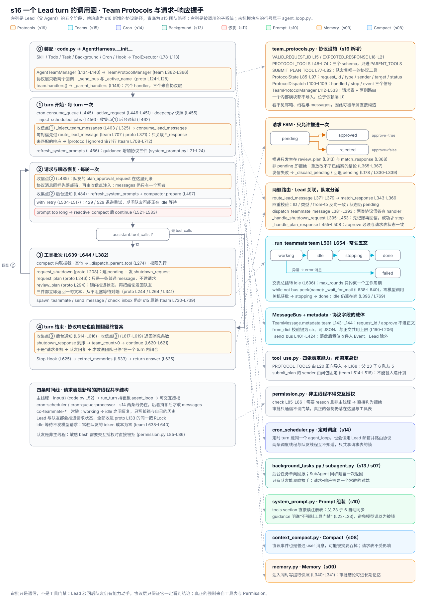

# s16 Team Protocols 调用图

> 本图描述 s16 新增的 Team Protocols 如何接入 [harness/agent_loop.py](./harness/agent_loop.py)
> 中的 `agent_loop`（L435-L649）。s15 已经把“队友”接进父循环，s16 只补一件事：让通信从
> “喊一声”变成“请求 - 响应”。本文按“装配 → turn 开始 → 循环内收信 → 工具批次 →
> turn 结束”组织，再展开关机握手、计划审批、idle 唤醒与响应关联四条路径。未标模块名的行号
> 属于 `agent_loop.py`，标 `proto` 的属于 [harness/team_protocols.py](./harness/team_protocols.py)，
> 标 `team` 的属于 [harness/agent_teams.py](./harness/agent_teams.py)。

图例：🟧 Team Protocols（s16 新增）；🟦 Agent Teams（s15）；🟪 Cron Scheduler（s14）；
🟩 Background Tasks（s13）；🟣 Task System（s12）；🔴 恢复分支（s11）；🟢 Prompt 组装（s10）；
🟠 Memory 子系统（s09）；🔵 Compact 子系统（s08）；⬜ 循环阶段、工具与 Hook。

## 总览



图与本文档同构：左列自上而下是 Lead（父 Agent）的阶段，左下是四条时间线，右列是被调用的
子系统，右下单独画出请求状态机。

| 区域 | 内容 | 对应代码 |
| --- | --- | --- |
| 左列 ⓪–④ | 装配 → turn 开始 → 每轮收信 → 工具批次 → turn 结束 | L59-L154、L435-L649 |
| 左列橙底行 | s16 的落点：装配协议层、收信时先路由、三个新工具 | L134-L140 / team L702-L713 / L146 |
| 左下时间线 | 主线程、`cron-scheduler`、`cron-queue-processor`、`cc-teammate-*` | L151、team L455-L462 |
| 右列上三块 | 协议设施：模块结构、请求 FSM、Lead / 队友两侧路由 | proto L48-L533 |
| 右列中三块 | 队友常驻五态、邮箱与 metadata、四张工具表 | team L561-L654、team L143-L206、tool_use.py L159-L170 |
| 右列下六块 | 复用子系统：Permission、s14 Cron、s13 后台、s10 Prompt、s08 Compact、s09 Memory | permission.py L85 等 |
| 右列状态图 | `pending → approved / rejected` 与队友五态 | proto L94-L95、team L580-L653 |

配色沿用前几章约定，橙色是 s16 新增的协议路径，蓝色是 s15 团队路径，虚线箭头表示“阶段调用
子系统”。底部一行提示最容易混淆的边界：审批只是**通信**，不是工具门禁——Lead 驳回后队友
仍有能力继续动手，协议层只保证它一定看到结论。

## 各阶段的要点

### ⓪ 装配：协议层只拿到两个回调

| 调用 | 位置 | 作用 |
|---|---|---|
| `sub_handlers = self.builtins.handlers()` | L121 | 父 / 子 / 队友共享的基础工具来源 |
| `assert_inside_workdir(.mailboxes)` | L129-L131 | 🟦 邮箱目录先过工作区边界校验 |
| `AgentTeamManager(...)` | L134-L140 / team L328 | 🟦 只挑走 bash / read_file / write_file（team L346-L350） |
| ↳ `MessageBus(mailbox_dir)` | team L351 / L221 | 🟦 `RLock` + 目录，此时还没有线程 |
| ↳ `idle_poll_interval` 下限 0.01 | team L353-L354 | 🟧 传 0 也不会退化成忙等 |
| ↳ `_wake_events: dict[str, Event]` | team L360-L361 | 🟧 每名队友一个唤醒事件 |
| ↳ `TeamProtocolManager(_send_bus, _active_name)` | team L362-L366 / proto L115-L138 | 🟧 只注入“发信”和“查在岗” |
| `**self.team.handlers()` | L146 / team L730-L739 | 🟧 六个 handler 进父表，其中三个来自 proto L526-L533 |
| `_agent_lock` | L151 | 🟪 前台 turn 与定时 turn 的串行边界，队友不参与 |

隔离仍然落在工具表上，只是从三张变成四张：`PROTOCOL_TOOLS`（proto L48-L74）经
`tool_use.py` L20 导入后只进 `PARENT_TOOLS`（tool_use.py L168），`SUBMIT_PLAN_TOOL`
（proto L77-L82）经 `agent_teams.py` L19 只进 `TEAMMATE_TOOLS`（team L129）。于是父 23 个
工具、子 6 个、队友 5 个：**“提交计划”与“审批计划”天然不在同一张表里**，队友既不能批自己的
计划，也不能命令别人关机（test_s16.py L1573）。

### ① turn 开始：收信的同时完成协议路由

| 调用 | 位置 | 作用 |
|---|---|---|
| `cron.consume_queue()` | L445 | 🟪 原子取走到期任务 |
| `active_request` 选择 | L446-L451 | 🟪 显式用户请求 > 调度 prompt > `latest_user_request` |
| `copy.deepcopy(messages[-12:])` | L455 | 🟠 建立提取快照 |
| `_inject_background_notifications` | L462 | 🟩 s13 收集点① |
| `_inject_team_messages` | L463 / L325 | 🟦 收信点① |
| ↳ `consume_lead_messages` | team L702-L713 | 🟧 每封信先过 `route_lead_message` |
| ↳ `route_lead_message` → `match_response` | proto L371-L379 / L343-L369 | 🟧 只有 `*_response` 才去关联请求 |
| ↳ `print("[protocol] ignored …")` | team L708-L712 | 🟧 未匹配的响应留一行审计 |
| `refresh_system_prompts(messages)` | L466 | 🟢 guidance 增加三条协议说明（system_prompt.py L21-L24） |
| `memory.load_memories` | L467-L468 | 🟠 side-query 召回 |

协议路由被放在 `consume_lead_messages` 内而不是 `_inject_team_messages` 内，是为了让
`check_inbox` 工具与三个收信点共用同一个出口：无论 Lead 是被动收信还是主动查信，
`shutdown_response` 都恰好被关联一次，状态机也只推进一次（test_s16.py L2026）。

### ② 每轮循环：模型边界仍是唯一的消费点

| 调用 | 位置 | 作用 |
|---|---|---|
| `_inject_background_notifications` | L484 | 🟩 s13 收集点② |
| `_inject_team_messages` | L485 | 🟦🟧 收信点②：队友的 `plan_approval_request` 在这里到账 |
| `refresh_system_prompts` / `compactor.prepare` | L497-L498 | 🟢🔵 先写 Prompt 再按预算压缩 |
| `with_retry(...)` | L504-L517 | 🔴 429 / 529 重试，期间队友可能正处于 idle 等待 |
| `reactive_compact` 分支 | L521-L533 | 🔴 prompt 溢出：压缩后 `continue` |
| `cron.acknowledge(...)` | L543-L550 | 🟪 首次成功响应 = 投递完成 |

队友线程只往邮箱文件追写（team L411-L417），从不触碰 `messages`；协议状态则活在
`TeamProtocolManager._requests`（proto L134）里，由一把 `RLock`（proto L133）保护。因此
s16 有两处共享状态：消息靠“单写者 + 消费式读取”，请求表靠“锁内推进一次”。

### ③ 工具批次：协议三件没有特权路径

| 调用 | 位置 | 作用 |
|---|---|---|
| `_execute_tool_batch` | L639-L644 / L382 | 只维护协议与分发，返回控制信号 |
| ↳ `_dispatch_parent_tool` | L274 | 权限先行，再选前台或后台 |
| ↳ `spawn_teammate` | team L439-L473 | 🟦 校验 → 建 record → 建唤醒事件 → 起 daemon 线程 |
| ↳ `request_plan` | proto L246-L264 | 🟧 只发一条普通 `message`，不建请求 |
| ↳ `review_plan` | proto L294-L341 | 🟧 锁内推进状态，再把结论发回队友 |
| ↳ `request_shutdown` | proto L208-L244 | 🟧 建 pending 请求 + 发 `shutdown_request` |
| ↳ `run_check_inbox` → `consume_lead_messages` | team L715 / L702 | 🟦🟧 与收信点共用消费出口 |
| `ToolExecutor.execute` | tool_use.py L243 | Hook + Permission + handler 同一条管线 |

三件工具都是“立即返回一句文本”，没有任何一个会阻塞等待对端（proto L244 / L264 / L341）。
`request_shutdown` 的返回值只表示“请求已发出”，队友是否真的停下要等 `shutdown_response`
回来才能确认——这正是它与“直接杀线程”的区别。

### ④ turn 结束：协议响应同样能推翻“最终答案”

| 调用 | 位置 | 作用 |
|---|---|---|
| `_inject_background_notifications` | L614-L616 | 🟩 s13 收集点③ |
| `_inject_team_messages` | L617-L619 | 🟦🟧 收信点③，返回消息条数 |
| `if background_count or team_count: continue` | L620-L621 | 🟧 `shutdown_response` 也算一条消息 |
| `hooks.trigger("Stop")` | L625 | 返回非 None 则追加 user 消息并回到 ② |
| `memory.extract_memories` | L633 | 🟠 快照里含 `<team_inbox>` 事件 |
| `return answer` | L635 | 正常出口 |

于是“Lead 请求关机 → 队友回复 → Lead 才敢说团队已停”这条链在一个 turn 内就能闭合：
响应到账使 `team_count>0`，模型被强制再看一轮（test_s16.py L2120）。

## Team Protocols 模块调用关系

```text
agent_loop.py
├─ AgentTeamManager(...)                                          L134-L140  team L328
│  ├─ MessageBus(mailbox_dir)                                     team L351 / L221
│  ├─ _wake_events: dict[str, threading.Event]                    team L360-L361
│  └─ TeamProtocolManager(self._send_bus, self._active_name)      team L362-L366  proto L115
│     ├─ _send_message / _resolve_active（注入的两个回调）          proto L124-L125
│     ├─ _request_id_factory（默认 secrets，测试可注入）            proto L128-L131
│     ├─ _requests: dict[str, ProtocolState] + RLock              proto L133-L134
│     └─ _handled_requests / _delivered_responses（本地记账）       proto L137-L138
├─ _parent_handlers ← team.handlers()                             L146      team L730-L739
│  ├─ spawn_teammate / send_message / check_inbox                 team L734-L736
│  └─ **self.protocols.handlers()                                 team L738  proto L526-L533
│     ├─ request_shutdown                                         proto L208-L244
│     ├─ request_plan                                             proto L246-L264
│     └─ review_plan                                              proto L294-L341
├─ _inject_team_messages（收信点 ①②③）                       L463 / L485 / L617
│  └─ consume_lead_messages()                                     team L702-L713
│     ├─ bus.read_inbox("lead")                                   team L705 / L287
│     ├─ protocols.route_lead_message(message)                    team L707  proto L371
│     │  └─ match_response（ID / 类型 / 双方 / 重放四重校验）        proto L343-L369
│     └─ 未匹配的 *_response → [protocol] ignored 审计行            team L708-L712
└─ cc-teammate-<name> 线程
   └─ _run_teammate(name, role, prompt)                           team L561-L654
      ├─ _teammate_handlers（闭包固定 sender）                     team L503-L517
      │  └─ submit_plan → protocols.submit_plan(sender, plan)     team L514-L516  proto L266
      ├─ _process_teammate_inbox（每轮开头）                       team L535-L559
      │  ├─ protocols.dispatch_teammate_message(name, msg)        team L545  proto L381-L393
      │  │  ├─ shutdown_request → _handle_shutdown_request        proto L395-L453
      │  │  └─ plan_approval_response → _handle_plan_response     proto L455-L508
      │  ├─ dispatch.event → messages.append（协议也要让模型看见）   team L546-L548
      │  ├─ dispatch.stop → _set_record(name, "stopping")         team L549-L552
      │  └─ 其余 → inbox_event(ordinary) 一条 user 事件            team L553-L558
      ├─ 工作周期：for _ in range(max_rounds)                      team L584-L625
      ├─ 无 tool_calls → result 消息 + status="idle"               team L599-L609
      ├─ 超轮次 → error 消息 + status="idle"（不再判死）            team L629-L636
      ├─ idle 等待：while not bus.peek(name): _wait_for_mail       team L638-L640
      └─ 关机获批 → status="done"；异常 → error + "failed"         team L642-L654
```

## 四条内部路径

### 优雅关机握手

```text
Lead: request_shutdown("scanner")                          proto L208-L244
  → _resolve_active → team._active_name（三态视为在岗）      proto L211  team L384-L399
  → 锁内查重：同名 pending 只允许一条                        proto L214-L230
  → _create_state("shutdown", "lead", target, "")           proto L231 / L154-L176
  → _send_message(lead→target, "shutdown_request", {id})    proto L232-L239  team L401
  → 发信失败 → _discard_pending 后返回错误                   proto L240-L243 / L178-L184
队友: _process_teammate_inbox → _handle_shutdown_request     team L545  proto L395-L453
  → 七项校验：存在 / 类型 / pending / 发信方是 Lead /
     收信方是自己 / to 字段一致 / ID 未处理过                 proto L405-L417
  → 不合法 → handled=True + 一条 [Protocol ignored] 说明     proto L418-L429
  → 先记账 _handled_requests.add(id) 再回信                  proto L430-L440
  → 回信失败 → discard 记账并报 [Protocol error]             proto L441-L451
  → 回信成功 → ProtocolDispatch(handled=True, stop=True)     proto L452-L453
  → 队友落 stopping → 跳出外层循环 → status="done"           team L549-L552 / L642-L643
Lead: 收信点读到 shutdown_response → match_response 关联     L463/L485/L617  proto L343
```

“先记账再发信”让重放无效，“发信失败就撤销记账”让重试有效（proto L431 / L444）。两者合起来
的语义是：Lead 每重发一次 `shutdown_request`，队友最多回一封 `shutdown_response`
（test_s16.py L2026）。

### 计划审批闭环

```text
队友: submit_plan(plan)                                     team L514-L516  proto L266-L292
  → sender 由闭包传入，再经 _resolve_active 校验             proto L269-L271
  → _create_state("plan_approval", teammate, "lead", plan)   proto L274-L279
  → _send_message(teammate→lead, "plan_approval_request")    proto L280-L287
  → 发信失败 → _discard_pending（不留永远等不到的 pending）    proto L288-L291
Lead: review_plan(request_id, approve, feedback="")         proto L294-L341
  → approve 必须是 bool                                     proto L302-L303
  → 锁内：存在 / 类型是 plan_approval / 仍 pending           proto L305-L312
  → status = "approved" | "rejected"（只推进一次）           proto L313-L314
  → feedback 为空时补一句 Approved / Rejected               proto L316-L321
  → _send_message(lead→sender, "plan_approval_response",
     {"request_id": id, "approve": approve})                proto L322-L329
  → 发信失败 → 回退成 pending，允许重新审批                  proto L330-L339
队友: _handle_plan_response                                 proto L455-L508
  → approve 反推 expected_status，必须与请求表一致            proto L466-L482
  → 已投递过则忽略（_delivered_responses）                   proto L483 / L498
  → 注入 [Plan approved] / [Plan rejected] Feedback: …      proto L500-L507
```

`state.status == expected_status`（proto L482）是这条路径的关键：伪造一封 `approve=true`
不足以把被驳回的计划变成通过，因为 Lead 落定的状态在请求表里，而请求表只有 `review_plan`
能改（test_s16.py L2080）。同时协议**只通信不设门禁**——被驳回的队友仍然可以调用 bash，
真正的强制来自 Permission 与工具表，这一点在 guidance 里也明确写出（system_prompt.py L22-L23）。

### idle 队友与唤醒

```text
_run_teammate 外层：while not shutdown_requested             team L577-L640
  → 每次进入先 _process_teammate_inbox（可能直接收到关机）     team L578-L579
  → _set_record(name, "working", summary)                    team L580
  → 内层 for _ in range(max_rounds)：一个“活跃工作周期”        team L584-L625
      ├─ 无 tool_calls → result + status="idle" + 打印        team L599-L609
      └─ 有 tool_calls → executor.execute(display_prefix)     team L611-L625
  → 未完工（超轮次）→ error + status="idle"                   team L629-L636
  → while not bus.peek(name): _wait_for_mail(name)            team L638-L640
        ├─ Event.wait(idle_poll_interval) → clear()           team L426-L437
        └─ 事件缺失 → 退回 time.sleep（不抛异常）              team L431-L434
_send_bus 落盘后置位收件人的 Event（Lead 除外）                team L401-L424
  → Lead 没有待命线程，它的信由父循环三个收信点自取             team L418-L419
```

idle 是 s16 队友生命周期的核心改动：s15 的队友交完总结就终止，s16 交完总结转 `idle`
（team L606），`max_rounds` 因此只约束**一次**工作周期而不是整个生命周期。等待期间不调用
模型，所以常驻队友的 token 成本是零；`peek`（team L307）只看文件是否存在，唤醒延迟由
Event 决定而不是轮询周期（test_s16.py L2145）。`_active_name` 与 `active_count` 都把
`{"working","idle","stopping"}` 视为在岗（team L396 / L769），idle 队友因此仍能收信、发信、
被关机。

### 响应关联与反重放

```text
match_response(message)                                     proto L343-L369
  → metadata 取 request_id / approve（类型不对即视为缺失）     proto L346-L349 / L186-L206
  → 请求必须存在                                              proto L350-L353
  → EXPECTED_RESPONSE[state.type] 必须等于 message.type       proto L354-L356 / L18-L21
  → from_agent == state.target 且 to_agent == state.sender    proto L357-L364
  → state.status 必须仍是 pending（否则是重放）                proto L365-L367
  → 通过后推进 status 并返回 (True, status)                   proto L368-L369
route_lead_message(message)                                 proto L371-L379
  → 非 shutdown_response / plan_approval_response 直接放行     proto L374-L378
```

四重校验分别挡掉四类问题：未知 ID（伪造）、类型错配（拿计划回复冒充关机回复）、双方不匹配
（第三方串单）、状态非 pending（重放）。校验全部在同一把锁内完成，因此并发多名队友同时回信
也不会出现“两封响应都被认为有效”（test_s16.py L2047）。请求 ID 自身还要过
`VALID_REQUEST_ID`（proto L15）——它会随消息落到邮箱文件里，因此和 Agent 名一样
按白名单字符收紧。

## 四条时间线

| 动作 | 主线程（Lead turn） | `cron-scheduler` | `cron-queue-processor` | `cc-teammate-*` |
| --- | --- | --- | --- | --- |
| 读 `input()` / 交互授权 | ✔ code.py L52 | — | — | ✘ permission.py L85-L86 |
| 改写 `messages` | ✔ | 从不 | ✔（持锁时） | 从不（只写自己的私有历史） |
| 写邮箱文件 | ✔ 工具 handler 内 | — | ✔ | ✔ team L411-L417 |
| 推进请求状态 | ✔ `review_plan` / `match_response` | 从不 | ✔（持锁时） | ✔ 两个 `_handle_*`（proto L395 / L455） |
| 发起协议请求 | ✔ 协议三件 | — | ✔ | 只有 `submit_plan`（team L129） |
| idle 等待唤醒 | ✘ | — | — | ✔ team L638-L640 |
| 持 `_agent_lock` | ✔ `run_turn` L156-L164 | 从不 | ✔ 非阻塞 L173-L175 | 从不 |
| 可创建新 Agent | ✔ task / spawn_teammate | — | ✔ | ✘ TEAMMATE_TOOLS 里没有 |

请求表是 s16 新增的跨线程共享结构：Lead 主线程和多名队友线程都会推进它，因此每次读改写都
必须在 `proto L133` 的同一把 `RLock` 内完成。相比之下，`messages` 的写者仍然只有一个——
协议消息也要先落邮箱、再由收信点注入，没有任何一条协议路径能绕过这个次序。

## 错误与边界

| 位置 | 检查 | 失败输出 |
| --- | --- | --- |
| `TeamMessage.from_dict` | `metadata` 必须是 dict 且键为 `str` | `mailbox metadata must be an object with string keys`（team L190-L196） |
| `TeamMessage.from_dict` | `metadata` 必须可 JSON 序列化 | `must be JSON serializable`（team L197-L203） |
| `TeamMessage.from_dict` | `metadata` 与正文共用 `MAX_MESSAGE_CHARS` | `mailbox metadata is too large`（team L204-L206） |
| `_new_request_id` | 工厂返回非法或重复 ID（重试 100 次） | `RuntimeError: could not allocate …`（proto L140-L152） |
| `_create_state` | 未知协议类型 | `unsupported protocol type`（proto L163-L164） |
| `request_shutdown` | 目标不在岗 / 已有 pending 关机 | `is not active` / `already pending`（proto L211-L230） |
| `request_shutdown` | 发信失败 | `_discard_pending` 后返回 `Error:`（proto L240-L243） |
| `request_plan` | 目标不在岗 / `task` 为空 | `Error: …`（proto L249-L253） |
| `submit_plan` | sender 不在岗 / `plan` 为空 | `Error: …`（proto L269-L273） |
| `submit_plan` | 发信失败 | 回收 pending 后返回 `Error:`（proto L288-L291） |
| `review_plan` | `approve` 非 bool / 请求不存在 / 类型不符 / 已审批 | `Error: …`（proto L302-L312） |
| `review_plan` | 结论发信失败 | 状态回退 pending，可重新审批（proto L330-L339） |
| `match_response` | ID 缺失、类型错配、双方不符、状态非 pending | `(False, reason)` + `[protocol] ignored` 审计（proto L343-L369 / team L708-L712） |
| `_handle_shutdown_request` | 任一校验不通过 | `handled=True` + `[Protocol ignored]`，队友继续工作（proto L418-L429） |
| `_handle_shutdown_request` | 响应发信失败 | 撤销记账 + `[Protocol error]`，不置 `stop`（proto L441-L451） |
| `_handle_plan_response` | `approve` 与请求表状态不一致 | `[Protocol ignored]`，不注入审批结论（proto L472-L496） |
| `_run_teammate` | 超过 `max_rounds` | 发 `error` 但落 `idle`，Lead 可改派或关机（team L629-L636） |
| `_run_teammate` | 任意异常 | 发 `error`；连发信也失败仍落定 `failed`（team L645-L654） |
| `_wait_for_mail` | 唤醒事件已被移除 | 退回 `time.sleep`，不打断收尾（team L431-L434） |
| `PermissionPolicy.check` | 非主线程不得交互授权 | 队友的敏感 bash 直接被拒（permission.py L85-L86） |

协议失败一律收口成“可读文本 + 状态不变”，从不抛给父循环，也不进入 Error Recovery：它们是
本地状态校验，重发模型请求解决不了。唯一的例外是 `_new_request_id`——ID 分配不出来意味着
注入的工厂坏了，属于编程错误，应当直接 `RuntimeError`。

## 依赖层

| 层 | 模块 | 内部依赖 |
|---|---|---|
| L0 | `config.py`、`models.py`、`system_prompt.py`、`error_recovery.py`、`task_system.py`、`background_tasks.py`、`cron_scheduler.py`、`team_protocols.py` | 无 |
| L1 | `provider.py`、`permission.py`、`skill_loading.py`、`todo_write.py`、`agent_teams.py`（→ `config`、`provider`、`team_protocols`） | L0 |
| L2 | `hooks.py`（→ `permission`）、`memory.py`（→ `skill_loading`） | L0-L1 |
| L3 | `tool_use.py`（→ `hooks`、`task_system`、`cron_scheduler`、`agent_teams`、`team_protocols`）、`context_compact.py`（→ `hooks`） | L0-L2 |
| L4 | `subagent.py`（→ `tool_use`） | L0-L3 |
| L5 | `agent_loop.py` | L0-L4，composition root |

`team_protocols.py` 是第十六课，却落在最底层 L0：它一个内部模块都不导入，连工具 schema 都
自己用 `_protocol_tool`（proto L24-L44）现搭，就是为了不去碰 `tool_use.py`。它需要的能力
全部由构造注入——`send_message` 与 `resolve_active` 两个回调（proto L124-L125）。于是
`agent_teams.py` 正向导入它（team L19），`tool_use.py` 也正向导入它（tool_use.py L20），
两条依赖都不成环。代价是协议层完全“看不见”邮箱、线程和 `messages`，收益是它可以被单测
直接构造，测试里只需塞两个 lambda（test_s16.py L1899-L1978）。

## 协议生命周期示例

```text
T0    Lead: spawn_teammate("scanner", "log auditor", "统计 ERROR 行数")
        → _records["scanner"]=working + _wake_events["scanner"]=Event()
T1    Lead: request_plan("scanner", "清理 90 天前日志")
        → 只是一封普通 message，请求表此时仍是空的（proto L246-L264）
T2    scanner 收到消息 → 模型决定 submit_plan("先备份再删除…")
        → _create_state → req_ab12cd34 = pending（proto L274-L279）
        → plan_approval_request 落到 .mailboxes/lead.jsonl
T3    Lead 下一轮开头收信点② 读到请求 → 作为 <team_inbox> 事件进入历史
        → 模型调 review_plan("req_ab12cd34", approve=False, feedback="先只归档")
        → 状态 pending → rejected，plan_approval_response 发回 scanner
T4    scanner 交完本轮总结 → result 消息 + status="idle" → 进入 Event 等待
        → _send_bus 落盘时置位它的 Event，等待立即结束（team L420-L423）
        → _handle_plan_response 校验 approve=False 与 rejected 一致
        → 注入 "[Plan rejected] Feedback: 先只归档" 后重新开始一个工作周期
T5    Lead: request_shutdown("scanner") → req_ef56ab78 = pending
        → scanner 校验通过 → 回 shutdown_response → dispatch.stop=True
        → status: idle → stopping → done（team L549-L552 / L642-L643）
T6    Lead 收信点③ 读到 shutdown_response → match_response 关联成功
        → team_count>0 → continue → 模型确认团队已停后才给最终答案
T6'   若这封响应被伪造（ID 未知或双方不符）→ [protocol] ignored 审计行
        → 请求仍是 pending，Lead 可以重发关机请求
```

与 s15 的区别集中在 T4 与 T5：s15 的队友在 T4 就终止了，Lead 无从确认“它是不是还活着”；
s16 的队友在 T4 只是转 idle，直到 T5 走完一次握手才落 `done`。代价是队友不会自行退出，
Lead 必须显式关机——`RESERVED_TEAMMATE_NAMES`、`max_rounds` 之外，又多了一条需要 Lead
负责的生命周期义务。

## 四条贯穿性线索

1. **请求表是唯一真相，且只推进一次。** `pending → approved / rejected` 的推进只发生在
   `review_plan`（proto L313）与 `match_response`（proto L368）两处，都在锁内；任何重复
   投递都会因 `status != "pending"` 被挡住（proto L365-L367）。两个本地记账集合
   （proto L137-L138）再补上“同一封信不重复回复、同一条结论不重复注入”。
2. **依赖倒置换来无环。** 协议层只接受 `send_message` 与 `resolve_active` 两个回调
   （proto L124-L125），因此可以待在 L0 被所有人导入。它不知道邮箱、线程与 `messages`，
   所以 s16 的三个新工具接进父表时，`agent_loop.py` 一行逻辑都不必改——`team.handlers()`
   （L146）自动把 `**self.protocols.handlers()`（team L738）带了进来。
3. **通信不等于强制。** 审批只保证队友一定看到结论（proto L500-L507），并不阻止它继续调用
   工具；guidance 也把这句写在 Prompt 里（system_prompt.py L22-L23）。真正的强制仍来自
   工具表与 Permission：队友只有 5 个 schema（team L103-L130），敏感操作在非主线程还会被
   直接拒绝授权（permission.py L85-L86）。
4. **常驻的代价是零 token，退出的代价是一次握手。** idle 队友在 `peek` 与 `Event.wait`
   之间空转（team L638-L640），不发模型请求；被唤醒的延迟由发信方置位决定
   （team L420-L423），轮询只是兜底。于是“队友还在不在岗”这个问题有了确定答案：
   `active_count` 把三种在岗态一起数（team L762-L771），只有走完关机握手的 `done` 和异常
   路径的 `failed` 才算离场。
