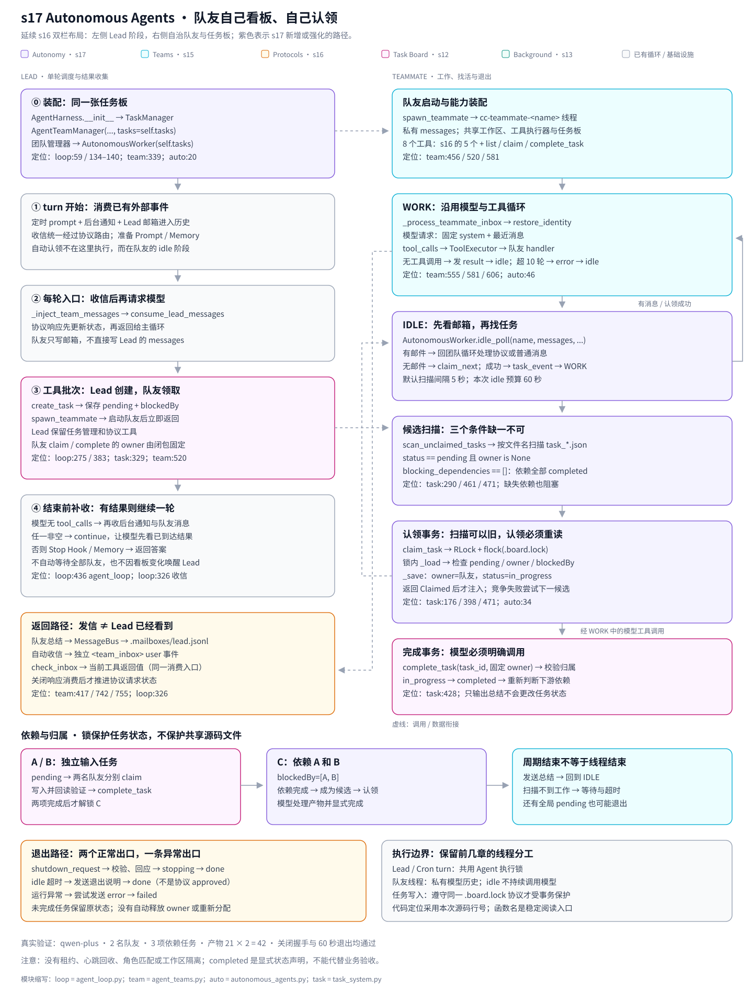

# s17 Autonomous Agents 调用图



本图延续 s16 的白底双栏与子系统配色。左侧呈现 Lead 的装配、收信、工具与返回阶段，右侧展开队友工作、空闲扫描和任务状态转换。紫色为 s17 新增或强化的路径，青色为团队循环，橙色为协议，粉色为任务板。实线表示主要顺序，虚线表示调用或数据衔接。

入门解释和真实验证记录见 [README](./README.md)。行号对应绘图时的源码，后续修改时优先按函数名定位。

## 从哪个入口开始看？

| 路径 | 代码入口 | 要理解的关系 |
| --- | --- | --- |
| 共享任务板装配 | [agent_loop.py](./harness/agent_loop.py#L134) | 将 Lead 的同一个 TaskManager 传入团队管理器 |
| 启动队友 | [spawn_teammate](./harness/agent_teams.py#L456) | 启动私有上下文线程，立即返回 |
| 工作周期 | [_run_teammate](./harness/agent_teams.py#L581) | WORK 与 IDLE 交替；模型调用留在团队模块 |
| 空闲策略 | [idle_poll](./harness/autonomous_agents.py#L63) | 优先检查邮件，再尝试认领，无工作则有界等待 |
| 候选扫描 | [scan_unclaimed_tasks](./harness/task_system.py#L461) | pending、无 owner、依赖已完成 |
| 认领重试 | [claim_next](./harness/task_system.py#L471) | 候选可能过期；认领成功才注入，竞争失败试下一项 |
| 事务保护 | [board_locked](./harness/task_system.py#L176) | 线程锁与稳定锁文件保护任务读改写 |
| 认领校验 | [claim_task](./harness/task_system.py#L398) | 锁内重读状态、归属、依赖，再保存 in_progress |
| 任务完成 | [complete_task](./harness/task_system.py#L428) | 校验队友 owner，保存 completed，判断下游解锁 |
| 身份提醒 | [restore_identity](./harness/autonomous_agents.py#L46) | 新周期短历史补身份，首条 system 保持在前 |
| 结果回到 Lead | [consume_lead_messages](./harness/agent_teams.py#L742) | 先路由协议，再交给自动注入或 check_inbox |

## 三条关键调用链

### 1. 找工作：扫描与认领分开

```text
_run_teammate → idle_poll
  → bus.peek：有邮件就返回团队协议路由
  → claim_next
      → scan_unclaimed_tasks
      → claim_task：锁内重读、检查、保存
      → 成功：读取记录 → task_event → messages.append
  → 返回 work → 下一工作周期请求模型
```

扫描不持有贯穿整个过程的锁，因此两个队友可能看见同一候选；最终归属由 claim_task 的事务决定。邮箱与看板也不是一个原子事务，优先检查邮件不等于能打断随后发生的认领。

### 2. 做完工作：总结与任务完成分开

```text
模型 complete_task → ToolExecutor → 固定队友身份的 handler
  → TaskManager.complete_task → 校验 in_progress 与 owner
  → 保存 completed → 检查被解锁的下游任务

模型无 tool_calls → 发 result → 设置 idle → 再找工作
```

两条路径相互独立。只发总结不会自动完成任务；退出时也不会自动释放或完成已认领任务。

### 3. 退出与通知：线程状态和协议状态分开

```text
收到关闭请求 → 协议校验 → 发 shutdown_response → 队友退出
  → Lead 下次消费响应 → 请求 pending → approved

idle 超时 → 发退出说明 → 队友 done
  （不创建关闭请求，不伪造 approved）
```

关闭消息在收信点处理，不能强制中断模型请求或工具批次。Lead 收到关闭响应也不等同于已经 join 完队友线程。

## 图中需要保留的边界

- 自动认领发生在队友的 idle 路径，Lead 无需逐项 assign。
- 默认进入 idle 先立即检查，后续约每 5 秒扫描；单次 idle 预算 60 秒。事件可提前唤醒邮件等待。
- WORK 最多 10 轮；超轮次汇报后仍可回 idle。锁等待或模型调用不受 idle 预算强制中断。
- 任务板锁只保护遵守该协议的写入者，不保护共享源码的并发编辑。
- Lead 的三个自动收信点与 check_inbox 共用消费入口；Lead 不会因任务板变化自动启动新 turn。
- 任务状态持久化不代表队友线程、模型历史和协议请求可以重启恢复。
